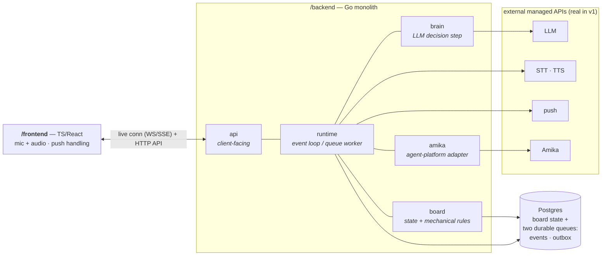
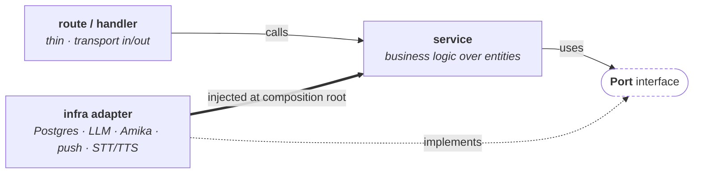

# Kiln — Technical Architecture (v1)

## **Date:** 2026-07-03

**Status:** Template — to be filled in
**Scope:** v1, single project, single user
**Relationship to** `01`**:** `01-initial.md` is the approved product & architecture design. This
document is the **technical design spec** it defers to (`01` §11). It decides *how* the system
is built; it must not re-open the product decisions in `01`.

## Framing

### 1. Purpose & scope of this doc

This document decides **how** Kiln is built — the technical items `01` §11 deferred — without
re-opening the product decisions in `01`.

**What 02 decides:**

- The **stack**: language, framework, and data store per surface area.
- The **module topology**: how `01` §4's logical components become real, hard-bounded modules
inside one deployable.
- The **Amika interface**: its shape as a contract, held as an interface until Amika's real docs
land (`01` §11).
- The **development harness**: the DevOps, tests, linting, and skills that let this system be
built — largely by coding agents — reliably (§4).

**Technical non-goals for v1 (deliberately not decided here):**

- **No production or cloud-hosting decisions.** v1 runs entirely locally via Docker Compose;
choosing a cloud/PaaS is future work.
- **No deterministic external mocks yet.** The end-to-end test hits real services (LLM, Amika,
STT/TTS). Swapping in local fakes for a fully offline, deterministic e2e loop is a later
optimization, not a v1 requirement.
- **No multi-project / multi-user / multi-orchestrator** machinery (`01` §10).
- **No STT/TTS/push provider selection** at the framing level — those stay managed-API
placeholders resolved in their surface-area sections (§§9–10).

**Audience.** Implementers — and specifically the **coding agents** that will build Kiln. A
first-class goal of this document is that current, sometimes low-intelligence, models can do real
work in this codebase. That constraint drives the architecture as much as the runtime behavior
does: hard module boundaries, machine-checkable guardrails, and a self-documenting skill library
are not polish — they are load-bearing (§4). This doc is the input to the implementation plan;
the first thing built from it is the harness (§4), before the product itself.

### 2. System topology

**One deployable, hard internal boundaries.** For v1 (single project, single user) the
orchestrator is a **modular monolith** — the fewest moving parts to run and reason about. But the
module seams are load-bearing, not cosmetic: they are what let **multiple agents build the system
in parallel without colliding**, and what let brain / runtime / board be split into separate
services later when scale demands it. Every module talks to its neighbors through an explicit
interface, even though they share a process today.

**Concretizing** `01` **§4's five logical components into real units:**


| `01` §4 component                  | Where it lives in v1                                                   |
| ---------------------------------- | ---------------------------------------------------------------------- |
| Web client                         | `/frontend` — a separate TS/React app; the only other deployable       |
| Orchestrator service (brain + API) | `/backend` — Go, as internal modules: API, brain, runtime/queue-worker |
| Board state store                  | Postgres — the single source of truth                                  |
| Agent-platform integration (Amika) | A module in `/backend` behind an interface                             |
| Voice pipeline                     | STT/TTS as managed APIs, bridged by the runtime + client               |


**Container view (local, Docker Compose):**




**Where state lives.** *All* authoritative state is in Postgres — board entities **and two
durable queues** in the same database, both drained by the runtime but doing different jobs:

- the **event queue** — the two `01` event types (agent-turn-completed, human-voice-input);
each entry wakes the brain for one LLM pass. This queue *drives the brain*.
- the **outbox** — mechanical work emitted transactionally by board state changes: agent
dispatch/instruct, the pull trigger, notifications, client board updates (`03` §7). Entries
are executed by adapters with no LLM involved. This queue *drives the machinery*.

The `/backend` process holds no authoritative state between events; it reads and writes Postgres
and drains both queue tables, so a restart or deploy recovers by re-reading durable state (`01`
§8). The `/frontend` holds none (`01` §4).

**Trust boundary.** The single trust boundary is `/backend`: it owns Postgres, all provider
credentials (LLM, STT/TTS, push, Amika), and is the only writer of board state. The client is
untrusted and disposable; external providers are reached only from the backend.

**Internal layering of a backend module.** The module boundaries above are horizontal (api,
runtime, brain, board, amika). *Inside* each module the code is layered vertically into three
roles, and the dependency direction is strict — **outer layers depend inward, never the reverse**:

1. **Interfaces (routes / handlers)** — the module's entry points: HTTP routes, queue-event
  handlers, the client-facing surface. They are thin. Their job is to translate transport in and
   out (decode a request or event, encode a response) and delegate. Infrastructure is **injected
   into this layer as interfaces (ports)**, not constructed here.
2. **Services (business logic)** — where the real work lives: enforcing rules and managing the
  module's **logical entities** (a Ticket, a Sandbox binding, an event). Services depend on
   infrastructure only through the injected **port interfaces** — never on a concrete client or a
   `*sql.DB`. A service is pure business logic plus a set of ports.
3. **Infrastructure (adapters)** — the concrete implementations of those ports: the Postgres
  repository, the LLM client, the Amika client, the push/STT/TTS clients. They are wired in at a
   single composition root and injected upward.




The payoff is directly the §4 harness goal: because a service names its dependencies as port
interfaces, an agent working that service tests it against **fakes** (an in-memory repository, a
scripted LLM) with no real Postgres, LLM, or Amika in the loop. This is the seam that later lets a
module become its own service — the ports are already the network boundary in disguise.

### 3. Technology stack

The recurring rationale below is a single principle: **maximize the machine-checkable guardrail
surface so weak models are caught by tools, not luck** — and keep moving parts minimal.


| Surface area       | Choice                                                                              | Alternatives considered                         | Rationale                                                                                                                                                                                                                                                     |
| ------------------ | ----------------------------------------------------------------------------------- | ----------------------------------------------- | ------------------------------------------------------------------------------------------------------------------------------------------------------------------------------------------------------------------------------------------------------------- |
| Backend language   | **Go**                                                                              | TypeScript end-to-end; Python                   | Compiler can't be cheated the way TS can — no `any`, no ignore-pragma, forced `if err != nil`. Small language surface + `gofmt`/`go vet` give weak models fewer ways to go wrong. Native concurrency fits the event-loop/queue runtime; single static binary. |
| Wire contract      | **Language-neutral schema** (OpenAPI / JSON-Schema) generating both Go and TS types | Shared TS package; hand-written types each side | A neutral schema forces the client↔server interface to be written down and reviewed as its own artifact — the contract two parallel agents agree on before writing code. Boundary stays machine-enforced across the language split.                           |
| State + queue      | **Postgres** (single engine for both)                                               | Postgres + Redis/SQS; separate stores           | Board mutation and the events/side-effects it enqueues commit in one transaction (answers §5's transactionality question). Deploy-resumable recovery falls out: restart → drain the queue table (`01` §8). No extra broker in the harness.                    |
| Orchestrator brain | **Anthropic SDK (Go)**, model TBD in §6                                             | —                                               | Official Go SDK; tool-calling is JSON schemas. Provider/model pinned in §6.                                                                                                                                                                                   |
| Amika integration  | **Interface + adapter** in Go                                                       | —                                               | Held as a contract until real docs land (`01` §11); see §7.                                                                                                                                                                                                   |
| Frontend           | **TypeScript / React**, mobile-first PWA                                            | —                                               | Framework/build details decided in §11. Types generated from the wire schema.                                                                                                                                                                                 |
| Voice pipeline     | Managed **STT/TTS** APIs (real in v1)                                               | —                                               | Providers chosen in §9.                                                                                                                                                                                                                                       |
| Notifications      | Managed **push** (real in v1)                                                       | —                                               | Transport chosen in §10.                                                                                                                                                                                                                                      |
| Hosting            | **Local only — Docker Compose**                                                     | Fly.io / Railway / cloud                        | Infra is out of scope for v1 (§1); local-first keeps the harness the focus.                                                                                                                                                                                   |


### 4. DevOps

DevOps is not a back-of-the-doc concern for Kiln — it is the **first thing built** and it drives
the rest of the architecture. Kiln is designed to be constructed largely by coding agents,
including low-intelligence models, so the development environment must let a weak model be dropped
into one area and reliably succeed. The harness has four parts.

**a. Deterministic checks at three levels — the hard gate.** Every module has **unit** tests and
component-level **integration** tests; the whole system has an **end-to-end** test that exercises
the real loop live. These are the objective pass/fail signal a weak model relies on instead of
reasoning about correctness. Linters + type-check + tests run as a **blocking gate** — pre-commit
and pre-merge. Red means you cannot land. The green checkmark is a wall, not a suggestion. (v1's
e2e hits real services; deterministic fakes are a later optimization — §1. Test-framework choices
are deferred to §14.)

**b. Incredible linters.** The guardrail surface is made as broad as possible so machines, not
luck, catch weak models: aggressive `golangci-lint` on the backend; a TS config that **bans the
escape hatches** (`any`, `as`, `@ts-ignore`, non-null `!`, unused symbols) so the frontend can't
wriggle out of types either. Formatting is auto-enforced (`gofmt` / Prettier) so agents never
spend turns on style.

**c. A skill per surface area, self-maintaining.** Each product surface area ships a **skill**
that explains how to work in that area — its spec, its details, its gotchas. `AGENTS.md`
instructs agents to **update their area's skill as they work**, so each skill is living
documentation that accumulates the area's spec and hard-won detail over time.

**d. General skills.** Area-agnostic how-to-work skills: end-to-end development, working in the local environment — that apply to every agent.

**Repository & layout.** One **monorepo**:

```
/backend            Go orchestrator (api · runtime · brain · board · amika modules)
/frontend           TS/React client
/schema             the language-neutral wire contract (generates Go + TS types)
.agents/skills      canonical skill library — symlinked to .claude/skills and .codex/skills
AGENTS.md           agent working agreement (incl. "update your area's skill")
docker-compose.yml  the whole system on one machine
```

`.agents/skills` is authored once and symlinked into both `.claude/skills` and `.codex/skills`,
so the same skills feed whatever agent tool is driving. Parallel agents isolate via
branches/worktrees off the single repo. Schema, skills, and both sides of the wire contract
version together atomically.

**CI/CD & versioning.** CI runs the full hard gate (lint → type-check/build → unit → integration
→ e2e) on every push and pull request. Deployment/release automation and infrastructure-as-code
are **out of scope for v1** (§1) — the system runs locally via Docker Compose; a developer or
agent brings the whole thing up with a single `docker compose up`.

---


## Surface areas

*Each section uses the same sub-shape:*

- ***Responsibility** — the one thing this surface owns.*
- ***Interface** — the API / contract others use to reach it; what it emits.*
- ***Topology** — where this surface lives in the repo and how it decomposes internally into the §2
layering (routes/handlers → services over entities → ports → infra adapters), across one or both
deployables.*
- ***Dependencies** — what it relies on.*
- ***What to decide** — the open technical questions to resolve here.*


### 5. Board mechanism

**Responsibility.** *The authoritative state of one project's board — tickets, columns, zones,
sandbox bindings — plus the mechanical rules that govern it: invariants, the deterministic pull,
and the side-effect transitions from* `01` *§5.*

**Interface — the Board API.** *Define the operations the orchestrator brain (§5) and the pull
system call to mutate board state: create ticket, shape/mark-ready, move ticket (firing the*
`01` *§5 side effects), send-to-agent, accept-to-done. Specify what each returns, what events it
emits, and its authority (this is the single source of truth; nothing else mutates board state
directly).*

**Topology.** *Lives in* `/backend/internal/board`*, structured per the §2 layering: a thin
Board-API handler layer over board service(s) that own the logical entities (Ticket, Sandbox
binding, Column/Zone); a state-store **port** implemented by a Postgres repository adapter; an
Amika **port** (§8) for the dispatch/instruct side effects. Decide where the deterministic-pull
component sits — its own service, or part of the board service.*

**Dependencies.** *State store engine; Amika integration (§7) for the side effects that dispatch
or instruct agents.*

**What to decide.** *Persistence engine and schema. Each entity (Ticket, Sandbox, column, zone,
event) — its fields, valid states, and invariants. How the WIP cap (= available sandboxes) is
enforced atomically. How the deterministic pull is triggered and made race-free (a ready ticket
exists AND a sandbox is free). Concurrency/locking model. Whether side effects are transactional
with the state change or fire after commit.*

### 6. Orchestrator brain

**Responsibility.** *The* `(board state + event) → actions` *decision step (*`01` *§6): wake on one
event, load state, reason once, emit actions from the fixed tool set.*

**Interface.** 

*The tool schema exposed to the LLM, mapped onto the Board API (§4) plus notify/speak. Input contract: how board state and the event are serialized into the prompt. Output contract: the emitted actions and how they are applied.* 

*T*

**Topology.** 

*Lives in* `/backend/internal/brain`*; stateless. A single entry invoked by the runtime (§7) over a brain service that builds the prompt, calls the Anthropic agent SDK, and parses the emitted actions; the LLM is an injected **port** with a provider adapter, and actions are applied through*  
*the Board-API **port** (§5) plus notify/speak ports. No infrastructure of its own beyond the LLM adapter.*

*The agent will be given tools for interacting with the board.* 

**Dependencies.** *Board API (§4) for state and mutations; runtime (§6) to be invoked and to deliver notify/speak; Anthropic SDK will be our LLM provider.*

### 7. Orchestrator API + event queue / runtime

**Responsibility.** *The durable, deploy-resumable service shell that receives events, drives the
brain (§5) once per event, and faces the client. Implements the* `01` *key decision that the
orchestrator wakes on events, not a timer. The runtime drains the **two durable queues** of §2 —
the event queue (each entry → one brain invocation) and the outbox (mechanical side effects
executed by adapters, no LLM —* `03` *§7).*

**Interface.** *Event ingestion for the two* `01` *event types — agent-turn-completed (from §7) and
human-voice-input (from §8/§10). Client-facing contract: the live connection that pushes board
updates and the endpoints the client calls. Message/event schemas.*

**Topology.** *Spans* `/backend/internal/api` *(client-facing routes + the live-connection hub) and*
`/backend/internal/runtime` *(the event loop). Handlers ingest the two event types and client
calls; a runtime service drives the brain (§6) once per event and pushes board updates; **ports**
for the two durable queues (§2), brain, board, notifications, and Amika are wired here. This module holds the
**composition root** where every adapter is injected. Name the queue and live-connection transport
adapters.*

**Dependencies.** *Durable queue; brain (§5); board (§4); notifications (§9); Amika (§7).*

**What to decide.** *Queue technology and delivery semantics (at-least-once vs exactly-once),
ordering guarantees, and how a single-writer-per-project constraint is kept. Deploy-safe recovery:
draining a durable queue rather than trusting in-process state (*`01` *§8). Live-connection
transport choice is shared with the client (§10). How turn-completed and voice events are
serialized against each other.*

### 8. Agent-platform integration (Amika)

**Responsibility.** *Bridge to the agent platform: dispatch an agent into a sandbox, instruct a
running/blocked agent, receive a turn's result, and expose the queue the runtime triggers off of
(*`01` *§4). Recovers safely across deploys.*

**Interface.** *The dispatch / instruct / receive-result / queue contract. Define it as an
interface with a mock implementation until Amika's real API/SDK is in hand (*`01` *§11), so the rest
of the system can be built and tested against the mock.*

**Topology.** *Lives in* `/backend/internal/amika` *as the infra layer behind the Amika **port**
that board/runtime consume: a real adapter (dispatch / instruct / receive-result) plus an inbound
webhook/poll handler that maps a turn result to a runtime event, and a **mock adapter** used in dev
and e2e until the real SDK lands (*`01` *§11). No business logic — a pure adapter.*

**Dependencies.** *Amika's real API (deferred); board (§4) for sandbox-binding lifecycle.*

**What to decide.** *The concrete interface shape and auth. How a turn result arrives (webhook vs
poll) and maps to a runtime event. Sandbox lifecycle ↔ board binding (acquire on pull, hold
through Blocked, release on Done). Retry and dispatch-failure surfacing (*`01` *§8). What the mock
must simulate to make the end-to-end loop testable without real agents.*

### 9. Voice pipeline

**Responsibility.** *The I/O layer that turns speech into human-input events and the brain's
replies into audio: STT → brain → TTS (*`01` *§7). Independent of the orchestrator so it can be
tested separately.*

**Interface.** *Inbound: audio → text → a human-voice-input event to the runtime (§6). Outbound:
brain speak actions → synthesized audio to the client (§10).*

**Topology.** *Spans both deployables:* `/frontend` *owns mic capture and audio playback;*
`/backend` *owns STT/TTS **ports** with provider adapters plus the routes that bridge inbound
audio → text → a runtime human-input event and outbound speak → audio. Business logic is minimal —
this surface is mostly transport + adapters. Decide which side holds streaming/buffering.*

**Dependencies.** *STT and TTS providers; runtime (§6); client (§10) for mic capture and playback.*

**What to decide.** *STT and TTS providers. Audio transport (streaming vs batched) and format.
Latency budget for the round trip. Foreground-mic handling (*`01` *§7: mic open only while
foregrounded). How mishears are surfaced for the* `01` *§7 confirm-before-destructive rule.*

### 10. Notification transport

**Responsibility.** *Reach the user when the app is backgrounded or closed and the orchestrator
needs them (*`01` *§7) — e.g. a ticket moving to Blocked.*

**Interface.** *A send-notification capability the brain/runtime invoke; a deep link that opens the
app to an already-updated board with the voice channel attached.*

**Topology.** *Spans* `/backend` *(a push adapter behind a notifications **port** the brain/runtime
invoke) and* `/frontend` *(a service worker for registration, token handling, and deep-link
tap-to-open). Pure adapter on the backend side; no logical entities of its own.*

**Dependencies.** *A push provider; the runtime (§6); the client (§10) for registration and
tap-handling.*

**What to decide.** *Push transport (web push / FCM / APNs) and its mobile-web constraints. Which
events fire a notification. Deep-link / tap-to-open behavior. Registration and token lifecycle.*

### 11. Web client

**Responsibility.** *A deliberately thin, disposable, mobile-first surface that renders the board
over a live connection, captures mic audio, plays Kiln's voice, and receives notifications
(*`01` *§4). Holds no authoritative state.*

**Interface.** *Consumes the runtime's live connection (§6) and client endpoints; the voice
pipeline (§8) for audio; the notification transport (§9) for push and deep links.*

**Topology.** *All in* `/frontend`*, with its own internal layering mirroring §2 in FE terms: a
data/transport layer (the live-connection client and the API client generated from* `/schema`*)
feeding a board store, feeding presentational components; mic/audio, push registration, and
deep-link handling as separate modules. Identify the components that are the **image-snapshot**
targets (§4a).*

**Dependencies.** *Runtime (§6); voice pipeline (§8); notifications (§9).*

**What to decide.** *Framework and build. Live-connection transport (shared with §6: WebSocket vs
SSE). Board rendering and how live updates are applied. PWA vs. wrapped-native for mic + push on
mobile. Reconnection/resync after the connection drops.*

---


## Cross-cutting


### 12. Auth & security

*Single-user auth for v1 (*`01` *§10). Secrets management (LLM, STT/TTS, Amika, push credentials).
Sandbox isolation and trust boundaries. Where the confirm-before-destructive rule (*`01` *§7) is
enforced. Transport security for the live connection and webhooks.*

### 13. Reliability & error handling

*Realize* `01` *§8: retry policy for agent dispatch / result delivery and how persistent failure is
surfaced on a ticket; agent crash/timeout → Blocked with a reason; orchestrator recovery after
deploy via the durable queue; STT-error handling. Define observability — logging, metrics, and how
a stuck ticket becomes visible rather than stalling silently.*

### 14. Testing strategy

*Realize* `01` *§9. Unit-test the brain's* `(state + event) → actions` *step against a mocked Amika
with no real voice. Verify the full loop (create → dispatch → turn ends → decide → block → resume)
end-to-end with mocked agents. Exercise voice as a separable I/O layer. Define what the Amika mock
and any fixtures must provide.*

### 15. Deployment & operations

*Environments (dev / staging / prod) and how they differ. Release and rollback strategy tied to
the deploy-resumable runtime (§6, §13). Runtime configuration and secret injection. Cost model and
scaling limits for v1 (single project, single user).*

### 16. Decision log & open questions

*A running ADR-style list. Each entry: the decision, the alternatives considered, the rationale,
and its status (proposed / accepted / superseded). Keep the still-open questions here too — most
importantly the Amika API, which stays an interface (§7) until its real docs land.*