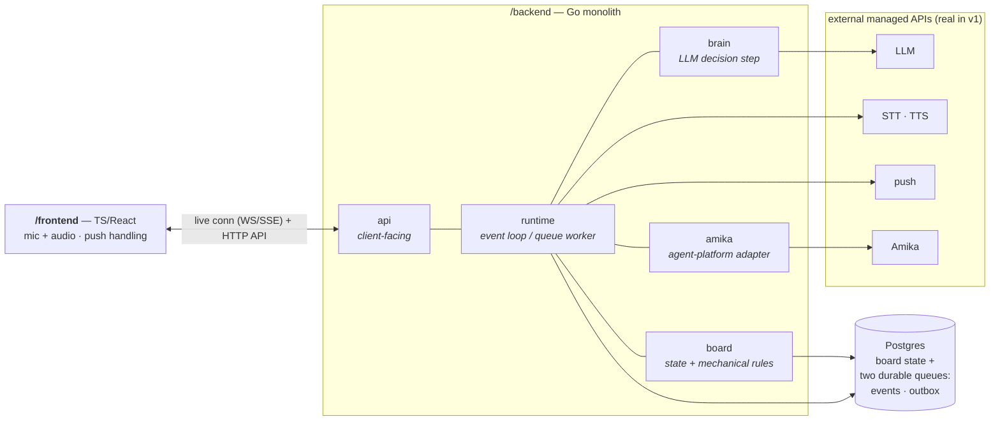

# Kiln — Technical Architecture (v1)

## **Date:** 2026-07-03

**Status:** Template — to be filled in
**Scope:** v1, single project, single user
**Relationship to** `01`**:** `01-initial.md` is the approved product & architecture design. This
document is the **technical design spec** it defers to (`01` §11). It decides *how* the system
is built; it must not re-open the product decisions in `01`.

## Framing

### 1. Purpose & scope of this doc

This document decides **how** Kiln is built — the technical items `01` §11 deferred — without
re-opening the product decisions in `01`.

**What 02 decides:**

- The **stack**: language, framework, and data store per surface area.
- The **module topology**: how `01` §4's logical components become real, hard-bounded modules
inside one deployable.
- The **Amika interface**: its shape as a contract, held as an interface until Amika's real docs
land (`01` §11).
- The **development harness**: the DevOps, tests, linting, and skills that let this system be
built — largely by coding agents — reliably (§4).

**Technical non-goals for v1 (deliberately not decided here):**

- **No production or cloud-hosting decisions.** v1 runs entirely locally via Docker Compose;
choosing a cloud/PaaS is future work.
- **No deterministic external mocks yet.** The end-to-end test hits real services (LLM, Amika,
STT/TTS). Swapping in local fakes for a fully offline, deterministic e2e loop is a later
optimization, not a v1 requirement.
- **No multi-project / multi-user / multi-orchestrator** machinery (`01` §10).
- **No STT/TTS/push provider selection** at the framing level — those stay managed-API
placeholders resolved in their surface-area sections (§§9–10).

**Audience.** Implementers — and specifically the **coding agents** that will build Kiln. A
first-class goal of this document is that current, sometimes low-intelligence, models can do real
work in this codebase. That constraint drives the architecture as much as the runtime behavior
does: hard module boundaries, machine-checkable guardrails, and a self-documenting skill library
are not polish — they are load-bearing (§4). This doc is the input to the implementation plan;
the first thing built from it is the harness (§4), before the product itself.

### 2. System topology

**One deployable, hard internal boundaries.** For v1 (single project, single user) the
orchestrator is a **modular monolith** — the fewest moving parts to run and reason about. But the
module seams are load-bearing, not cosmetic: they are what let **multiple agents build the system
in parallel without colliding**, and what let brain / runtime / board be split into separate
services later when scale demands it. Every module talks to its neighbors through an explicit
interface, even though they share a process today.

**Concretizing** `01` **§4's five logical components into real units:**


| `01` §4 component                  | Where it lives in v1                                                   |
| ---------------------------------- | ---------------------------------------------------------------------- |
| Web client                         | `/frontend` — a separate TS/React app; the only other deployable       |
| Orchestrator service (brain + API) | `/backend` — Go, as internal modules: API, brain, runtime/queue-worker |
| Board state store                  | Postgres — the single source of truth                                  |
| Agent-platform integration (Amika) | A module in `/backend` behind an interface                             |
| Voice pipeline                     | STT/TTS as managed APIs, bridged by the runtime + client               |


**Container view (local, Docker Compose):**




**Where state lives.** *All* authoritative state is in Postgres — board entities **and two
durable queues** in the same database, both drained by the runtime but doing different jobs:

- the **event queue** — the two `01` event types (agent-turn-completed, human-voice-input);
each entry wakes the brain for one LLM pass. This queue *drives the brain*.
- the **outbox** — mechanical work emitted transactionally by board state changes: agent
dispatch/instruct, the pull trigger, notifications, client board updates (`03` §7). Entries
are executed by adapters with no LLM involved. This queue *drives the machinery*.

The `/backend` process holds no authoritative state between events; it reads and writes Postgres
and drains both queue tables, so a restart or deploy recovers by re-reading durable state (`01`
§8). The `/frontend` holds none (`01` §4).

**Trust boundary.** The single trust boundary is `/backend`: it owns Postgres, all provider
credentials (LLM, STT/TTS, push, Amika), and is the only writer of board state. The client is
untrusted and disposable; external providers are reached only from the backend.

**Internal layering of a backend module.** The module boundaries above are horizontal (api,
runtime, brain, board, amika). *Inside* each module the code is layered vertically into three
roles, and the dependency direction is strict — **outer layers depend inward, never the reverse**:

1. **Interfaces (routes / handlers)** — the module's entry points: HTTP routes, queue-event
  handlers, the client-facing surface. They are thin. Their job is to translate transport in and
   out (decode a request or event, encode a response) and delegate. Infrastructure is **injected
   into this layer as interfaces (ports)**, not constructed here.
2. **Services (business logic)** — where the real work lives: enforcing rules and managing the
  module's **logical entities** (a Ticket, a Sandbox binding, an event). Services depend on
   infrastructure only through the injected **port interfaces** — never on a concrete client or a
   `*sql.DB`. A service is pure business logic plus a set of ports.
3. **Infrastructure (adapters)** — the concrete implementations of those ports: the Postgres
  repository, the LLM client, the Amika client, the push/STT/TTS clients. They are wired in at a
   single composition root and injected upward.


The payoff is directly the §4 harness goal: because a service names its dependencies as port
interfaces, an agent working that service tests it against **fakes** (an in-memory repository, a
scripted LLM) with no real Postgres, LLM, or Amika in the loop. This is the seam that later lets a
module become its own service — the ports are already the network boundary in disguise.

### 3. Technology stack

The recurring rationale below is a single principle: **maximize the machine-checkable guardrail
surface so weak models are caught by tools, not luck** — and keep moving parts minimal.


| Surface area       | Choice                                                                              | Alternatives considered                         | Rationale                                                                                                                                                                                                                                                     |
| ------------------ | ----------------------------------------------------------------------------------- | ----------------------------------------------- | ------------------------------------------------------------------------------------------------------------------------------------------------------------------------------------------------------------------------------------------------------------- |
| Backend language   | **Go**                                                                              | TypeScript end-to-end; Python                   | Compiler can't be cheated the way TS can — no `any`, no ignore-pragma, forced `if err != nil`. Small language surface + `gofmt`/`go vet` give weak models fewer ways to go wrong. Native concurrency fits the event-loop/queue runtime; single static binary. |
| Wire contract      | **Language-neutral schema** (OpenAPI / JSON-Schema) generating both Go and TS types | Shared TS package; hand-written types each side | A neutral schema forces the client↔server interface to be written down and reviewed as its own artifact — the contract two parallel agents agree on before writing code. Boundary stays machine-enforced across the language split.                           |
| State + queue      | **Postgres** (single engine for both)                                               | Postgres + Redis/SQS; separate stores           | Board mutation and the events/side-effects it enqueues commit in one transaction (answers §5's transactionality question). Deploy-resumable recovery falls out: restart → drain the queue table (`01` §8). No extra broker in the harness.                    |
| Orchestrator brain | **Anthropic SDK (Go)**, model TBD in §6                                             | —                                               | Official Go SDK; tool-calling is JSON schemas. Provider/model pinned in §6.                                                                                                                                                                                   |
| Amika integration  | **Interface + adapter** in Go                                                       | —                                               | Held as a contract until real docs land (`01` §11); see §7.                                                                                                                                                                                                   |
| Frontend           | **TypeScript / React**, mobile-first PWA                                            | —                                               | Framework/build details decided in §11. Types generated from the wire schema.                                                                                                                                                                                 |
| Voice pipeline     | Managed **STT/TTS** APIs (real in v1)                                               | —                                               | Providers chosen in §9.                                                                                                                                                                                                                                       |
| Notifications      | Managed **push** (real in v1)                                                       | —                                               | Transport chosen in §10.                                                                                                                                                                                                                                      |
| Hosting            | **Local only — Docker Compose**                                                     | Fly.io / Railway / cloud                        | Infra is out of scope for v1 (§1); local-first keeps the harness the focus.                                                                                                                                                                                   |


### 4. DevOps

DevOps is not a back-of-the-doc concern for Kiln — it is the **first thing built** and it drives
the rest of the architecture. Kiln is designed to be constructed largely by coding agents,
including low-intelligence models, so the development environment must let a weak model be dropped
into one area and reliably succeed. The harness has four parts.

**a. Deterministic checks at three levels — the hard gate.** Every module has **unit** tests and
component-level **integration** tests; the whole system has an **end-to-end** test that exercises
the real loop live. These are the objective pass/fail signal a weak model relies on instead of
reasoning about correctness. Linters + type-check + tests run as a **blocking gate** — pre-commit
and pre-merge. Red means you cannot land. The green checkmark is a wall, not a suggestion. (v1's
e2e hits real services; deterministic fakes are a later optimization — §1. Test-framework choices
are deferred to §14.)

**b. Incredible linters.** The guardrail surface is made as broad as possible so machines, not
luck, catch weak models: aggressive `golangci-lint` on the backend; a TS config that **bans the
escape hatches** (`any`, `as`, `@ts-ignore`, non-null `!`, unused symbols) so the frontend can't
wriggle out of types either. Formatting is auto-enforced (`gofmt` / Prettier) so agents never
spend turns on style.

**c. A skill per surface area, self-maintaining.** Each product surface area ships a **skill**
that explains how to work in that area — its spec, its details, its gotchas. `AGENTS.md`
instructs agents to **update their area's skill as they work**, so each skill is living
documentation that accumulates the area's spec and hard-won detail over time.

**d. General skills.** Area-agnostic how-to-work skills: end-to-end development, working in the local environment — that apply to every agent.

**Repository & layout.** One **monorepo**:

```
/backend            Go orchestrator (api · runtime · brain · board · amika modules)
/frontend           TS/React client
/schema             the language-neutral wire contract (generates Go + TS types)
.agents/skills      canonical skill library — symlinked to .claude/skills and .codex/skills
AGENTS.md           agent working agreement (incl. "update your area's skill")
docker-compose.yml  the whole system on one machine
```

`.agents/skills` is authored once and symlinked into both `.claude/skills` and `.codex/skills`,
so the same skills feed whatever agent tool is driving. Parallel agents isolate via
branches/worktrees off the single repo. Schema, skills, and both sides of the wire contract
version together atomically.

**CI/CD & versioning.** CI runs the full hard gate (lint → type-check/build → unit → integration
→ e2e) on every push and pull request. Deployment/release automation and infrastructure-as-code
are **out of scope for v1** (§1) — the system runs locally via Docker Compose; a developer or
agent brings the whole thing up with a single `docker compose up`.
