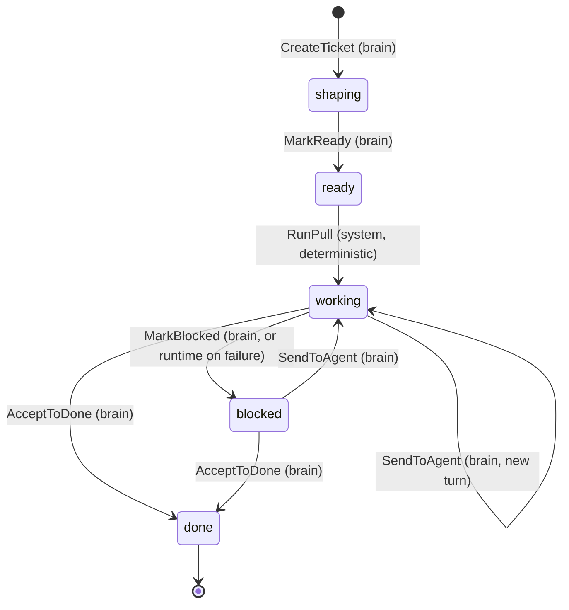

# Kiln — Board Mechanics (v1)

**Date:** 2026-07-03
**Status:** Proposed
**Scope:** v1, single project, single user
**Relationship to `01`/`02`:** `02` §5 defines the board mechanism's responsibility and lists
what remains to be decided. This document decides it: the entity model and persistence schema,
the Board API contract, the atomic WIP cap, the race-free deterministic pull, the
concurrency/locking model, and side-effect transactionality. It must not re-open the product
decisions in `01` §5 — every mechanic here is a realization of that section.

## 1. Purpose & scope

This document resolves everything `02` §5 leaves open, and nothing else:

- Each entity (Ticket, Sandbox, outbox entry) — fields, valid states, invariants (§2–§3).
- The Board API — every operation's preconditions, state change, emissions, return, and
  errors (§4).
- The deterministic pull — how it is triggered and made race-free (§5).
- How the WIP cap (= available sandboxes) is enforced atomically (§3, §5).
- The concurrency/locking model (§6).
- Whether side effects are transactional with the state change or fire after commit (§7).
- Where the pull component sits (§9).

Out of scope: the queue *drain* loop and delivery semantics (runtime, `02` §7); the concrete
Amika dispatch/instruct payloads (`02` §8); the client-facing snapshot shape (wire schema,
`02` §3); prompt/tool bindings of these operations for the LLM (`02` §6).

## 2. Entity model

### 2.1 Ticket state — one field, five states

`01` §5 describes three columns with zones inside two of them. Mechanically this is a single
five-state machine; **column and zone are derived render groupings, not stored fields**:

| `state`   | Column (derived) | Zone (derived) | Sandbox bound? |
| --------- | ---------------- | -------------- | -------------- |
| `shaping` | Backlog          | Shaping        | No             |
| `ready`   | Backlog          | Ready          | No             |
| `working` | Developing       | Working        | Yes            |
| `blocked` | Developing       | Blocked        | Yes            |
| `done`    | Done             | —              | No             |



Every edge in this diagram is a named Board API operation (§4). There are no other edges: no
cancel/delete, no demote-from-ready, no reopen-from-done — `01` §5 defines none, so v1 has
none.

### 2.2 Ticket fields

| Field            | Type          | Notes                                                          |
| ---------------- | ------------- | -------------------------------------------------------------- |
| `id`             | uuid          | Primary key.                                                    |
| `title`          | text          | Required, non-empty.                                            |
| `body`           | text          | The shaped details; grows during Shaping.                       |
| `state`          | text          | One of the five states; CHECK-constrained (§8).                 |
| `priority`       | int           | Backlog ordering for the pull; higher pulls first. Default 0.   |
| `sandbox_id`     | uuid, null    | FK → `sandboxes`. Non-null iff `working`/`blocked`.             |
| `blocked_reason` | text, null    | Non-null iff `blocked`. What the user must decide, or the failure being surfaced. |
| `ready_at`       | timestamptz, null | Set by MarkReady; pull tie-breaker.                         |
| `created_at` / `updated_at` | timestamptz | Bookkeeping.                                       |

### 2.3 Sandbox

A sandbox row is a **capacity slot**, not a live resource handle. The table is seeded with N
rows (N from configuration at startup); the WIP cap is structural — it *is* the row count
(§3, I2).

| Field       | Type       | Notes                                                              |
| ----------- | ---------- | ------------------------------------------------------------------ |
| `id`        | uuid       | Primary key.                                                        |
| `amika_ref` | text, null | Amika's opaque sandbox identifier once known. Whether sandboxes are pre-provisioned in Amika or created on dispatch is decided in the Amika spec (`02` §8); the board only stores the ref. |
| `created_at`| timestamptz| Bookkeeping.                                                        |

A sandbox has no `status` column. **Free vs busy is derived**: a sandbox is busy iff an active
ticket (`working`/`blocked`) references it. Deriving rather than storing eliminates an entire
class of dual-write drift (§10, D2).

### 2.4 Outbox entry

Side effects and pull triggers are rows the board appends **in the same transaction** as the
state change (`02` §3 decided this engine-level; §7 here specifies the mechanics). The outbox
is one of the runtime's **two durable queues** (`02` §2) and is distinct from the event queue
that wakes the brain: the board writes only the outbox, and outbox entries are executed
mechanically by adapters — no LLM involved. The runtime owns the drain loop and delivery
semantics (`02` §7); the board owns only the emission contract:

| Field        | Type      | Notes                                              |
| ------------ | --------- | --------------------------------------------------- |
| `id`         | bigserial | Monotonic; doubles as the **idempotency key** (§7). |
| `topic`      | text      | One of §4's emission topics.                        |
| `payload`    | jsonb     | Snapshot taken at emit time (§7).                   |
| `created_at` | timestamptz | Bookkeeping. Delivery-state fields (attempts, next-attempt-at, done-at) are the runtime's, defined in its spec. |

## 3. Invariants

Each invariant names its **enforcement mechanism**. Service-layer checks give good errors;
database constraints are the backstop that holds even if service code is wrong — the
machine-checkable guardrail `02` §3 asks for.

| #  | Invariant | Enforced by |
| -- | --------- | ----------- |
| I1 | `state` is one of the five values in §2.1. | CHECK constraint. |
| I2 | **WIP cap:** at most one active (`working`/`blocked`) ticket per sandbox; Developing therefore holds ≤ N tickets. | Partial unique index on `tickets(sandbox_id) WHERE state IN ('working','blocked')`; N = row count of `sandboxes`. |
| I3 | `sandbox_id` is non-null iff `state` is `working`/`blocked`. | CHECK constraint. |
| I4 | `blocked_reason` is non-null iff `state` is `blocked`. | CHECK constraint. |
| I5 | Only the edges in §2.1's diagram are legal transitions. | Service layer: each operation locks the ticket row and verifies the from-state inside the transaction (§6); no generic state-setter exists. |
| I6 | Ready→Working happens **only** via the deterministic pull — never by brain action (`01` §6). | The Board API exposes no operation with that edge; `RunPull` is internal to the board module and not in the brain's tool set. |
| I7 | Every state change and its side-effect emissions commit atomically. | All operations are single transactions that write ticket + outbox rows together (§7). |
| I8 | Nothing outside the board module writes these tables. | Module boundary (`02` §2): the store port is private to `internal/board`; brain and runtime reach state only through the Board API. |

## 4. The Board API

The Board API is the **only** mutation surface for board state (I8). Callers: the brain
(`02` §6) for every operation except `RunPull`; the runtime for `RunPull` (driven by
`pull.evaluate` entries, §5) and for the mechanical failure path of `MarkBlocked` (§7.3).

Common behavior:

- Every operation is **one transaction**: lock the ticket row, verify preconditions, apply
  the change, append outbox rows, commit (§6).
- Every mutation returns the updated `Ticket` and emits `board.updated` (a signal entry; the
  runtime responds by pushing a fresh full snapshot to the client — §10, D7).
- Precondition failures return typed errors, never partial writes: `ErrNotFound`,
  `ErrInvalidTransition{From, Attempted}`. Strict — an already-blocked ticket being
  re-blocked is an error, not a no-op, so caller bugs surface loudly (`02` §4's
  weak-model principle).

| Operation | Inputs | Precondition | State change | Emits (beyond `board.updated`) |
| --------- | ------ | ------------ | ------------ | ------------------------------ |
| `CreateTicket` | title, body | title non-empty | new ticket, `shaping` | — |
| `ShapeTicket` | id, title?, body?, priority? | state ∈ {`shaping`, `ready`} | fields updated, state unchanged | — |
| `MarkReady` | id | state = `shaping` | → `ready`, sets `ready_at` | `pull.evaluate` |
| `SendToAgent` | id, instruction | state ∈ {`working`, `blocked`} | → `working`, clears `blocked_reason` | `amika.instruct` |
| `MarkBlocked` | id, reason | state = `working` | → `blocked`, sets `blocked_reason` | `notify.send` |
| `AcceptToDone` | id | state ∈ {`working`, `blocked`} | → `done`, clears `sandbox_id` + `blocked_reason` | `pull.evaluate` |
| `GetBoard` | — | — | none (read) | — |
| `RunPull` *(internal)* | — | see §5 | `ready` → `working` per pulled ticket | `amika.dispatch` per pulled ticket |

Notes:

- **`SendToAgent` covers two `01` §5 rows** — Blocked→Working (resume with the user's answer)
  and Working→Working (new turn). Same mechanics: persist the intent, emit `amika.instruct`.
- **`MarkBlocked` has two callers**: the brain (turn ended, human decision needed) and the
  runtime mechanically (agent crash/timeout, or dispatch/instruct retries exhausted — `01`
  §8), with the failure as `reason`. One operation, so the user-facing behavior (notification,
  Blocked zone) is identical.
- **`GetBoard`** returns the full snapshot: all tickets grouped by state in render order
  (Shaping by `priority` desc then `created_at`; Ready in **exact pull order** (§5) so the
  user sees what will be pulled next; Developing with Blocked stacked above Working), plus
  total/free sandbox counts. Its wire shape lives in `/schema`.
- **`Reprioritize` is not a separate operation** — priority is a `ShapeTicket` field. The
  brain reprioritizes by reshaping.

## 5. The deterministic pull

`01` §5: the pull is a system action, not a brain decision — it fires whenever a ready ticket
exists AND a sandbox is free.

**Trigger.** Exactly two operations can make the pull condition become true: `MarkReady`
(creates a ready ticket) and `AcceptToDone` (frees a sandbox). Both emit a `pull.evaluate`
outbox entry in their own transaction. The runtime drains it and calls `RunPull`. Because the
trigger rides the durable queue, crash-safety needs no special case: if the process dies
after `MarkReady` commits but before the pull runs, the entry is still there after restart
(`01` §8). No poller, no startup hook, no missed pulls.

**Algorithm.** `RunPull` loops, one transaction per binding, until no (ready ticket, free
sandbox) pair remains:

```sql
BEGIN;
  -- next ready ticket, deterministic order
  SELECT id FROM tickets
   WHERE state = 'ready'
   ORDER BY priority DESC, ready_at ASC, id ASC
   FOR UPDATE SKIP LOCKED LIMIT 1;

  -- a free sandbox = no active ticket references it
  SELECT s.id FROM sandboxes s
   WHERE NOT EXISTS (SELECT 1 FROM tickets t
                      WHERE t.sandbox_id = s.id
                        AND t.state IN ('working','blocked'))
   ORDER BY s.id
   FOR UPDATE OF s SKIP LOCKED LIMIT 1;

  -- if either SELECT is empty: ROLLBACK and stop.
  UPDATE tickets SET state = 'working', sandbox_id = $sandbox WHERE id = $ticket;
  INSERT INTO outbox (topic, payload) VALUES
    ('amika.dispatch', …),   -- §7
    ('board.updated', …);
COMMIT;  -- then loop
```

**Why this is race-free.** Two concurrent `RunPull`s (or a pull racing any other operation)
cannot double-bind:

- `FOR UPDATE` on the sandbox row serializes claimers; `SKIP LOCKED` makes the loser pick a
  *different* free sandbox (or stop) instead of blocking — the claim is atomic and
  contention-free.
- The same applies to the ticket row, so one ticket cannot be pulled twice.
- If service code ever gets this wrong anyway, the partial unique index (I2) rejects the
  second binding at commit. The database, not the process, is the last line of defense.

**Idempotent + at-least-once = safe.** `RunPull` re-run any number of times converges: it
binds only while the pull condition holds. Duplicate or coalesced `pull.evaluate` entries are
harmless, so the runtime's queue needs only at-least-once delivery.

**Correctness does not depend on the runtime.** `02` §7 contemplates a single writer per
project; if it holds, these locks never contend. The board does not rely on it — locking and
constraints make the mechanics safe under any interleaving (§10, D3).

## 6. Concurrency & locking model

- **One operation = one short transaction** at Postgres's default `READ COMMITTED`. No
  serializable isolation, no advisory locks, no long-lived transactions.
- **Lock, then check.** Every mutation begins `SELECT … FOR UPDATE` on the target ticket,
  then verifies the precondition on the locked row. Stale reads can't slip through: whoever
  locks second sees the first's committed state and fails with `ErrInvalidTransition` rather
  than clobbering.
- **`SKIP LOCKED` only in the pull**, where "pick any free one" semantics make skipping
  correct. Targeted operations must conflict loudly instead of skipping.
- **Constraints as backstop** (§3): even a buggy service path cannot persist an invariant
  violation. This is deliberate defense in depth for a codebase built largely by weak models
  (`02` §1) — the invariant holds even when the code that should have enforced it doesn't.

## 7. Side effects: transactional outbox

**Decision:** side effects are **recorded transactionally, executed after commit** — the
transactional-outbox pattern `02` §3's single-engine choice was made for.

### 7.1 Emission topics

| Topic | Emitted by | Executed by (runtime hands off to) | Payload snapshot |
| ----- | ---------- | ----------------------------------- | ---------------- |
| `amika.dispatch` | `RunPull` | Amika adapter (`02` §8) | ticket id, sandbox id, title + body as the work instruction |
| `amika.instruct` | `SendToAgent` | Amika adapter | ticket id, sandbox id, instruction text |
| `notify.send` | `MarkBlocked` | Push adapter (`02` §10) | ticket id, title, reason |
| `pull.evaluate` | `MarkReady`, `AcceptToDone` | board `RunPull` (§5) | — (signal only) |
| `board.updated` | every mutation | live-connection hub (`02` §7) | — (signal; hub pushes a fresh `GetBoard` snapshot) |

Payloads are **snapshots taken at emit time**, so executing an entry never re-reads mutable
state — replay is deterministic.

### 7.2 Execution semantics

The runtime drains entries **at least once** (its spec owns delivery mechanics). Handlers
are made safe to repeat: the entry `id` travels as the idempotency key on `amika.dispatch` /
`amika.instruct` (the adapter — and its mock — must honor it), duplicate `pull.evaluate` and
`board.updated` are harmless by construction, and a rare duplicate notification is accepted
as benign.

### 7.3 Effect failure

An effect failing does **not** roll back the board — the state change already committed and
is authoritative. Per `01` §8, the runtime retries with backoff; on exhaustion:

- `amika.dispatch` / `amika.instruct` failed → the agent never got the message: the runtime
  calls `MarkBlocked(ticket, reason: dispatch failure …)` — the failure surfaces on the
  ticket and notifies the user, instead of a Working ticket stalling invisibly.
- `notify.send` failed → log and drop; the board is already correct and the user sees the
  Blocked ticket on next open. No state change.

## 8. Persistence schema (DDL sketch)

Definitive shape for the migration; `text + CHECK` rather than a native enum (§10, D6).

```sql
CREATE TABLE sandboxes (
  id         uuid PRIMARY KEY,
  amika_ref  text,
  created_at timestamptz NOT NULL DEFAULT now()
);

CREATE TABLE tickets (
  id             uuid PRIMARY KEY,
  title          text NOT NULL CHECK (title <> ''),
  body           text NOT NULL DEFAULT '',
  state          text NOT NULL DEFAULT 'shaping'
                 CHECK (state IN ('shaping','ready','working','blocked','done')),
  priority       int  NOT NULL DEFAULT 0,
  sandbox_id     uuid REFERENCES sandboxes(id),
  blocked_reason text,
  ready_at       timestamptz,
  created_at     timestamptz NOT NULL DEFAULT now(),
  updated_at     timestamptz NOT NULL DEFAULT now(),
  CHECK ((state IN ('working','blocked')) = (sandbox_id IS NOT NULL)),      -- I3
  CHECK ((state = 'blocked') = (blocked_reason IS NOT NULL))                -- I4
);

-- I2: the WIP cap — at most one active ticket per sandbox
CREATE UNIQUE INDEX one_active_ticket_per_sandbox
  ON tickets (sandbox_id) WHERE state IN ('working','blocked');

CREATE INDEX tickets_ready_pull_order
  ON tickets (priority DESC, ready_at ASC, id ASC) WHERE state = 'ready';
```

The `outbox` table's board-owned columns are §2.4; the runtime spec finalizes its
delivery-state columns and owns its migration jointly with this module.

Changing capacity = inserting a sandbox row (takes effect on next pull) or deleting a free
one. v1 seeds N from configuration at startup and reconciles by insert-only (never
auto-delete a row an active ticket references — the FK would refuse anyway).

## 9. Module topology

Per `02` §2's layering, all inside `/backend/internal/board`:

- **Service** — `BoardService`: the operations of §4, the transition rules of §2–§3, and the
  pull algorithm of §5. **The deterministic pull is part of the board service** — it is a
  mechanical board rule (`01` §5), not runtime logic; the runtime merely delivers its
  trigger.
- **Store port** — the persistence interface the service names; private to the module (I8).
- **Postgres adapter** — implements the store port; owns the §8 DDL/migrations and the
  row-locking queries. Injected at the composition root (`02` §7).
- **No Amika port.** The outbox decision (§7) means the board never calls Amika — it appends
  intent rows; the runtime's drain loop invokes the Amika adapter. This supersedes `02` §5's
  topology sketch of an Amika port inside board (§10, D5). The board's only infrastructure
  dependency is Postgres.

**Testing** (realizing `02` §14 for this module): unit tests exercise `BoardService`
transition rules and error paths against an in-memory store fake — asserting emitted outbox
rows *is* asserting side effects, no Amika fake needed. Integration tests run against real
Postgres: constraint backstops (I1–I4 reject bad writes), and a concurrency test hammering
`RunPull` from parallel goroutines to prove no double-binding under contention.

## 10. Decision log

| # | Decision | Alternatives considered | Rationale |
| - | -------- | ----------------------- | --------- |
| D1 | Single five-value `state` field; column/zone derived. | Stored `(column, zone)` pair. | One field to constrain and reason about; a pair can drift into meaningless combinations (Done+Blocked) that CHECKs must then forbid anyway. |
| D2 | WIP cap is structural: N sandbox rows + partial unique index; free/busy derived. | `status` column on sandboxes; a WIP counter. | Nothing to keep in sync, so nothing can drift; atomicity comes from row locking + the index, not from disciplined bookkeeping. |
| D3 | Pull = idempotent `RunPull` triggered by transactional `pull.evaluate` entries. | In-process call after commit; background poller. | In-process trigger is lost on crash between commit and call; a poller adds latency and a moving part. The queue entry commits with the enabling change, so at-least-once drain + idempotence covers every crash window. |
| D4 | Named transition operations; no generic `MoveTicket(to)`. | Generic move with a transition-validity table. | Each verb carries its own preconditions, payload, and emissions — impossible to invoke an edge that doesn't exist (I5, I6); far harder for a weak model to misuse. |
| D5 | Transactional outbox; board holds no Amika port. | Board calls Amika port directly after commit (as `02` §5's topology sketch suggested). | Direct calls reintroduce the crash window and scatter retry logic; the outbox is what `02` §3 chose Postgres-as-queue *for*. Supersedes the `02` §5 sketch — flagged for the `02` §16 decision log. |
| D6 | `text + CHECK` for `state`, not a native Postgres enum. | `CREATE TYPE … AS ENUM`. | Adding a state is a plain constraint swap in one migration; enum alteration is a known migration footgun for no runtime benefit at this scale. |
| D7 | `board.updated` triggers a full-snapshot push, not diffs. | Per-change diff events. | Single project, one user, tens of tickets: snapshots are trivially small, make client resync-after-reconnect free, and keep the thin client thin (`01` §4). |
| D8 | Strict preconditions — repeated/invalid transitions are typed errors, not no-ops. | Idempotent no-op semantics. | Loud failure surfaces brain/runtime bugs immediately (`02` §4); event idempotency is handled where it belongs, at the brain/queue layer (`02` §6–§7). |
| D9 | Pull order: `priority DESC, ready_at ASC, id ASC`. | FIFO only. | `01` §2 requires voice reprioritization; priority gives the brain the lever, the timestamp keeps ties deterministic, `id` breaks equal-timestamp ties so the order is total. |
| D10 | No cancel/delete/reopen operations. | Adding a cancel edge. | `01` §5 defines no such transitions; inventing them here would re-open product design. When `01` grows them, they arrive as new named operations. |

**Open questions (owned elsewhere):** outbox delivery-state columns and drain semantics
(runtime spec, `02` §7); sandbox provisioning in Amika — pre-created vs on-dispatch — and the
concrete dispatch/instruct payload shapes (Amika spec, `02` §8); whether the shaping
conversation transcript is stored anywhere beyond the ticket body (brain spec, `02` §6).
