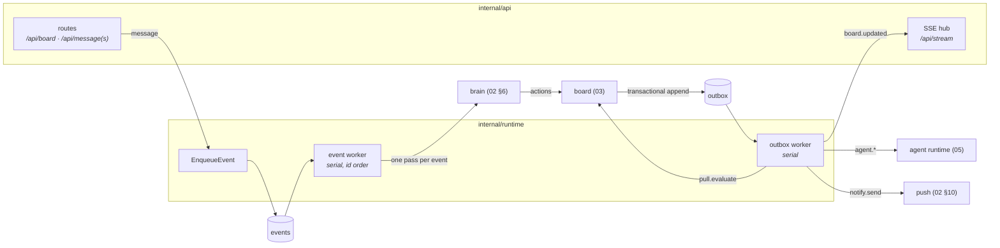

# Kiln — Runtime & Client API (v1)

**Date:** 2026-07-03
**Status:** Proposed
**Scope:** v1, single project, single user

## 1. Purpose & scope

This document resolves:

- The concrete shape of the **two durable queues** (`02` §2): the event queue and the
outbox — tables, delivery-state columns, drain machinery (§2–§3).
- **Delivery semantics**: at-least-once, retry/backoff, dead-lettering (§3).
- **Ordering** and the single-writer-per-project constraint; how turn-completed and human-message
events serialize against each other (§4).
- **Deploy-safe recovery** (§5).
- **Event ingestion** — how the two `01` event types enter the queue (§6).
- The **client-facing contract**: SSE + HTTP POST transport and the endpoint set (§7).
- **Module topology** and the composition root (§8).

Out of scope: 

- the brain's internals and its action idempotency (`02` §6); 
- the agent-runtime's inbound result mapping and payload shapes (`05`);


## 2. The two queues

Both queues are Postgres tables in the same database as board state (`02` §3), drained by
the runtime, one worker goroutine each. They share the same delivery-state columns and drain
machinery; they differ in who writes them and what a handled entry means:


|                 | **Event queue** (`events`)                                                        | **Outbox** (`outbox`)                                                                                            |
| --------------- | --------------------------------------------------------------------------------- | ---------------------------------------------------------------------------------------------------------------- |
| Drives          | The brain: one LLM pass per entry                                                 | The machinery: mechanical execution, no LLM                                                                      |
| Written by      | agent-runtime module (`agent.turn_completed` — `05`), message route (`human.message` — text in v1; 09 adds STT in front, 07 A1) | The board, transactionally with state changes (`03` §7)                                                          |
| Handled by      | Brain port (`02` §6)                                                              | Per-topic executors: agent-runtime module, push adapter, board `RunPull`, SSE hub                                       |
| Emitted entries | The brain's actions cause board ops, which append outbox rows                     | — (executors emit nothing; `MarkBlocked` on the dispatch-failure path appends via the Board API like any caller) |


```sql
-- shared delivery-state columns (both tables)
--   status          text NOT NULL DEFAULT 'pending'
--                   CHECK (status IN ('pending','done','dead'))
--   attempts        int NOT NULL DEFAULT 0
--   next_attempt_at timestamptz NOT NULL DEFAULT now()
--   last_error      text
--   processed_at    timestamptz

CREATE TABLE events (
  id       bigserial PRIMARY KEY,
  type     text  NOT NULL CHECK (type IN ('agent.turn_completed','human.message')),
  payload  jsonb NOT NULL,           -- shape owned by the emitter's spec (02 §8 / §9)
  created_at timestamptz NOT NULL DEFAULT now()
  -- + delivery-state columns
);

CREATE TABLE outbox (
  id       bigserial PRIMARY KEY,   -- doubles as the idempotency key (03 §7)
  topic    text  NOT NULL CHECK (topic IN
           ('agent.send','agent.release','notify.send','pull.evaluate','board.updated')),
  payload  jsonb NOT NULL,
  created_at timestamptz NOT NULL DEFAULT now()
  -- + delivery-state columns
);

CREATE INDEX events_due ON events (id) WHERE status = 'pending';
CREATE INDEX outbox_due ON outbox (id) WHERE status = 'pending';
```

This finalizes `03` §2.4's deferral: the board owns `id`/`topic`/`payload`/`created_at` and
the emission contract; the delivery-state columns and everything that touches them are the
runtime's. The two modules share the `outbox` migration.

## 3. Delivery semantics

**At-least-once, execute-then-mark.** Each worker loops:

1. Pick the next due entry: `status = 'pending' AND next_attempt_at <= now()`, ordered by
  `id`, `FOR UPDATE SKIP LOCKED` in a short claim transaction that only increments
   `attempts` (the lock guards against a second worker; today there isn't one — §10, D4).
2. Execute the handler **outside any queue transaction** — a brain pass or an outbox
  executor. Handlers may take seconds (LLM, agent platform); no lock is held while they run.
3. On success: `status = 'done'`, `processed_at = now()`. On error: `last_error` recorded,
  `next_attempt_at = now() + min(1s × 2^(attempts−1), 60s)`. After **8 attempts**:
   `status = 'dead'` and the per-topic dead-letter action below.

A crash anywhere between claim and mark leaves the entry `pending`; it re-runs after
restart. That is the whole recovery story — **at-least-once delivery plus handlers that are
safe to repeat**:

- `agent.send` / `agent.release` carry the outbox `id` as idempotency key; the agent-runtime
module and its mock must deduplicate on it (`03` §7, `05` §7).
- `pull.evaluate` and `board.updated` are idempotent by construction (`03` §5, D7).
- A replayed **brain pass** re-reads fresh board state; re-applied actions hit the Board
API's strict preconditions (`03` D8), so a half-applied first run cannot double-apply.
Finer-grained idempotency is the brain spec's concern (`02` §6).
- A rare duplicate notification is accepted as benign (`03` §7.2).

**Dead-letter actions per topic** (realizing `01` §8 — never stall silently):


| Entry                               | After 8 failed attempts                                                                                                                                               |
| ----------------------------------- | --------------------------------------------------------------------------------------------------------------------------------------------------------------------- |
| `agent.send`                        | Runtime calls `MarkBlocked(ticket, reason: delivery failure)` — surfaces on the ticket, notifies the user (`03` §7.3)                                                 |
| `notify.send`                       | Log at error level and drop; board already correct (`03` §7.3)                                                                                                        |
| `agent.release`                     | Log at error level; the agent-runtime reconciler heals the worker on its next sweep (`05` §4)                                                                          |
| `pull.evaluate` / `board.updated`   | Log at error level; both are re-emitted by the next enabling operation, so a dead entry self-heals                                                                    |
| event (brain pass kept failing)     | Log at error level and emit `notify.send` ("Kiln hit a system error handling X") — the ticket keeps its current state; the user is pulled in rather than left waiting |


## 4. Ordering & the single writer

**Events are processed strictly serially, in** `id` **order, by one worker goroutine.** This
*is* the single-writer-per-project constraint `02` §7 asks for, realized in-process: at most
one brain pass exists at any moment, and turn-completed and message events serialize against
each other simply by insertion order — whichever committed first is handled first, no
special interleaving rules. (v1 is one project; multi-project later means one such serial
lane per project, which the per-project `id` ordering already permits.)

**The outbox has its own serial worker.** Its entries are mechanical and idempotent, so
strict ordering isn't required for correctness — but serial execution is free and keeps the
system trivially predictable. The two workers are independent: an outbox execution (e.g.
`RunPull` binding a ticket) may interleave with an in-flight brain pass. That is safe by
`03`'s construction — board row locking plus strict preconditions resolve any collision, and
the pull is never a brain decision (`03` I6), so the two never want the same edge.

## 5. Wakeup & deploy-safe recovery

**Wakeup.** Each worker blocks on an in-process **nudge channel**, with a **1-second poll**
as fallback. Anything that commits a queue row nudges the matching worker (the API routes
and the agent-runtime module after inserting an event; the board's store adapter after a transaction
that appended outbox rows). The nudge is best-effort — a dropped nudge costs at most one
poll interval. No `LISTEN/NOTIFY` (§10, D5).

**Recovery needs no special code path.** Startup is just: run migrations, start the two
workers, serve. The first poll finds whatever was `pending` when the process died —
including entries claimed but never marked — and re-runs it. This realizes `01` §8's
"drain a durable queue rather than trusting in-process state" with zero
recovery-specific logic to get wrong.

## 6. Event ingestion

The runtime exposes one internal port:

```
EnqueueEvent(type, payload) → event id     -- INSERT into events + nudge
```

Two callers, per `01`'s two event types:

- **agent-runtime module** (`05`): a worker's turn reaches a terminal outcome →
`agent.turn_completed`, payload snapshot of the result.
- **Message route** (§7 below): user text arrives → `human.message` (`07` §4; `09` later
puts STT in front of the same seam).

Payloads are snapshots at ingestion time, `jsonb`, with shape contracts owned by the
emitting surface's spec. The runtime treats them as opaque and hands them to the brain.

## 7. Client-facing API

**Transport: SSE for server→client, plain HTTP POST for client→server.** Auto-reconnect is
native to `EventSource`, everything is ordinary HTTP, and full-snapshot pushes (`03` D7)
make resync-after-drop free — the client never needs replay, so `Last-Event-ID` is unused
(§10, D6/D7).


| Endpoint              | Method    | Contract                                                                                                                                                                                                                                                       |
| --------------------- | --------- | -------------------------------------------------------------------------------------------------------------------------------------------------------------------------------------------------------------------------------------------------------------- |
| `/api/stream`         | GET (SSE) | On connect: immediately send a `board` event with the full `GetBoard` snapshot, then one `board` event per `board.updated` outbox entry. `say` events deliver the brain's text replies (renamed from `speak` per `07` A1; `09` adds TTS on top). Comment-line keepalive every 25 s. |
| `/api/board`          | GET       | The same full snapshot, for initial render before the stream attaches or as a manual resync.                                                                                                                                                                   |
| `/api/message`        | POST      | User message in → transactional transcript append + `EnqueueEvent(human.message, …)` (`07` §3) → `202 Accepted` with the event id. Text `{text}` in v1 (`07` §4); `09` puts STT in front of this same seam.                                                 |
| *(push registration)* | —         | Named here for completeness; owned entirely by the notification spec (`02` §10).                                                                                                                                                                               |


All request/response and SSE-payload shapes live in `/schema` (`02` §3) — the client never
sees a hand-written type. Reconnection contract for the client (`02` §11): on `EventSource`
reconnect, the first `board` event *is* the resync; render it and discard nothing — snapshots
are absolute, never deltas.

Auth on these endpoints is deferred to `02` §12 (single-user; v1 is local-only).

## 8. Module topology & composition root

Per `02` §2's layering, across two modules:

- `/backend/internal/runtime` — the two workers (event worker → brain port; outbox
worker → per-topic executor ports), the drain/retry machinery of §3, `EnqueueEvent`, and
the queue tables' delivery-state migrations. Ports consumed: brain, board, agent runtime, push,
SSE hub.
- `/backend/internal/api` — the HTTP routes of §7 and the **SSE hub** (tracks connected
clients, fans out `board`/`say` events). Thin handlers: decode, delegate to
runtime/board, encode.
- `/backend/cmd/kiln` — the **composition root** (`02` §7): the only place concrete
adapters exist together. It constructs the Postgres store, LLM client, agent-runtime module (Amika or mock provider
(real or mock, by config), push and STT/TTS adapters; injects them through ports into
board, brain, runtime, and api; runs migrations; starts the workers and the HTTP server.




## 9. Testing

Realizing `02` §14 for these modules:

- **Unit (runtime):** the drain loop against fake handlers — success, transient failure →
backoff schedule, exhaustion → correct per-topic dead-letter action, crash-replay (claim
without mark → entry re-runs). The worker takes a clock interface so backoff is tested
without sleeping.
- **Unit (api):** routes against a fake runtime/board — decode/encode, snapshot-on-connect,
fan-out to multiple SSE clients, keepalive.
- **Integration:** real Postgres — two workers + real tables; kill the process between
execute and mark and verify re-run; verify `id`-order processing under concurrent inserts.
- **E2E seam:** this module is where the `02` §14 full loop runs — the mock agent provider emits a turn
result, event worker drives a scripted brain, outbox effects land, SSE client observes the
snapshots.


## 10. Decision log


| #   | Decision                                                                                       | Alternatives considered                                                     | Rationale                                                                                                                                                                                              |
| --- | ---------------------------------------------------------------------------------------------- | --------------------------------------------------------------------------- | ------------------------------------------------------------------------------------------------------------------------------------------------------------------------------------------------------ |
| D1  | Two tables (`events`, `outbox`) sharing delivery-state columns and drain code.                 | One table with a queue discriminator; separate bespoke machinery per queue. | The queues have different writers, consumers, and payload contracts — separate tables keep those contracts independent; shared columns keep the machinery single-sourced.                              |
| D2  | At-least-once delivery; no exactly-once machinery.                                             | Two-phase commit around handlers; transactional inbox on consumers.         | Exactly-once is a fiction over LLM and agent-platform calls anyway; idempotency keys + `03`'s strict preconditions absorb replays at a fraction of the complexity.                                              |
| D3  | Strictly serial event processing in `id` order — the single writer realized in-process.        | Concurrent brain passes; per-ticket lanes.                                  | One project, one user: concurrency buys nothing and creates prompt-state races (two passes reading the same board). Serial makes brain behavior reproducible — the `02` §14 test property.             |
| D4  | Execute-then-mark with claim-increments-attempts; no in-flight status, no lease/claim columns. | Status `in_flight` + lease timeouts.                                        | A crashed worker's lease machinery is real complexity; with one process per deployment, `pending` + re-run on restart covers every crash window. `SKIP LOCKED` already future-proofs multiple workers. |
| D5  | Wakeup = in-process nudge channel + 1 s poll fallback.                                         | `LISTEN/NOTIFY`; poll-only; timer-driven.                                   | Same process writes and drains the queues — a channel is free and instant; the poll catches dropped nudges and restart. `LISTEN/NOTIFY` adds a connection-state protocol for zero gain at this scale.  |
| D6  | SSE + HTTP POST transport.                                                                     | WebSocket.                                                                  | User decision. One protocol (HTTP) end to end, native auto-reconnect, fits text now and batched voice later; WS's bidirectional channel buys nothing until streaming mic audio exists.                                    |
| D7  | Stream carries absolute snapshots; reconnect = fresh snapshot; no `Last-Event-ID` replay.      | Delta events with replay on reconnect.                                      | Extends `03` D7: snapshots make the connection stateless, so reconnect logic is "render the next event" — nothing to get wrong in the thin client (`01` §4).                                           |
| D8  | Backoff `min(1s × 2^(attempts−1), 60s)`, 8 attempts (~2 min), then per-topic dead-letter.      | Retry forever; fixed intervals.                                             | Bounded so failures surface on the ticket while the user still has context (`01` §8); per-topic routing because "what failing means" differs per effect (`03` §7.3).                                   |
| D9  | Composition root in `/backend/cmd/kiln`, not inside `internal/runtime`.                        | Wiring inside the runtime module.                                           | Keeps every `internal/*` module adapter-free and port-pure (`02` §2); the binary is the only place concretes meet.                                                                                     |


**Open questions (owned elsewhere):** `agent.turn_completed` payload shape and
webhook-vs-poll arrival (`02` §8); `human.message` payload, audio format, and the
`say` SSE payload (`07` §4); push registration endpoint (`02` §10); endpoint auth
(`02` §12); brain-side action idempotency beyond the board's strict preconditions
(`02` §6).