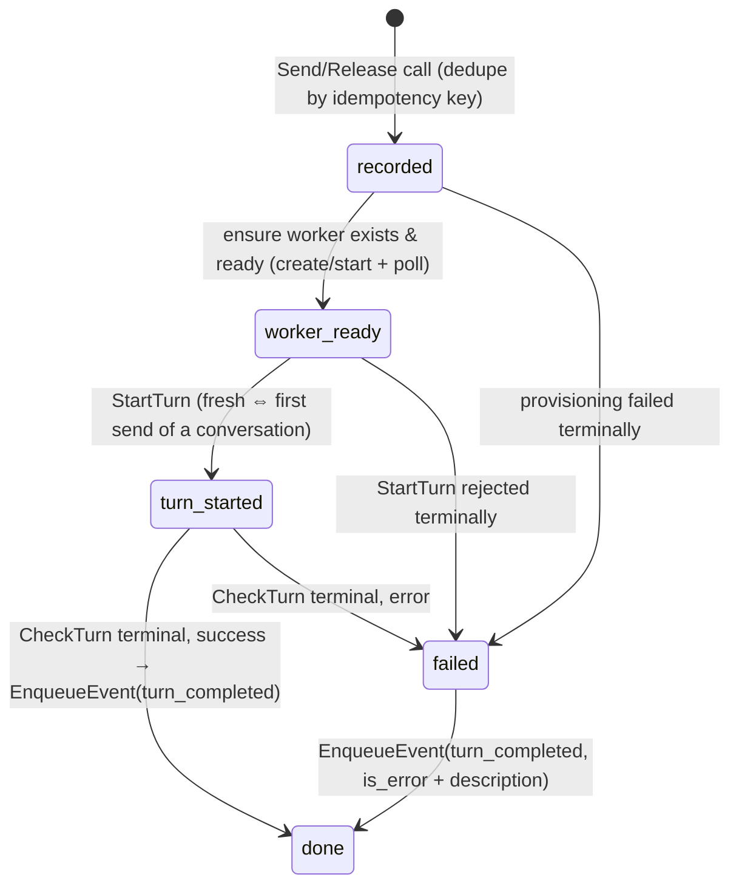

# Kiln — Agent Runtime (v1)

**Date:** 2026-07-03
**Status:** Proposed
**Scope:** v1, single project, single user
**Relationship to `01`–`04`:** `02` §8 held the agent-platform integration as an interface
until Amika's real docs landed. They have (**Amika API v0beta1**,
`https://app.amika.dev/api/v0beta1/llms.txt`) — and this document deliberately splits the
layer in two: a **provider-neutral agent-runtime contract** the rest of Kiln depends on
(§2–§3), and an **Amika adapter** that implements it (§5–§6). Nothing outside this module
may know Amika exists. The same-day amendments to `03`/`04` (worker rename, `agent.*`
topics) are logged in §10.

## 1. Purpose & scope

**The abstraction rule.** Other modules see exactly three things:

1. **Workers** — N opaque handles (the board's capacity slots, `03` §2.3). Not sandboxes,
   not sessions, not jobs.
2. **Send** — deliver a message to a worker (a ticket's work order, an instruction, an
   answer to a blocker).
3. **Output** — a worker's turn result arriving as an `agent.turn_completed` event.

Provisioning, sessions, job polling, branches, auth — every provider concept — lives
behind the contract. Swapping Amika for another agent platform (or adding one) must touch
only §5–§6 and configuration.

This document decides: the neutral contract (§2–§3); worker lifecycle ↔ board binding
(§4); the Amika adapter — API mapping, turn state machine, poller, idempotency (§5–§7);
the mock (§8); auth/config and module topology (§9).

Out of scope: what the brain does with a turn result (`02` §6); message *content*
(composed by the board's emitters — `03` §7.1).

## 2. The neutral contract

### 2.1 Consumed by the runtime's outbox worker (`04` §2)

```
AgentRuntime interface {
    // Send delivers one message to a worker. The first Send after a worker
    // is (re)created starts a fresh conversation; subsequent Sends continue
    // it. Record-and-return: never blocks on provisioning or the turn.
    Send(ctx, idempotencyKey int64, workerID, ticketID, message string) error

    // Release recycles a worker after AcceptToDone: its next conversation
    // must start from a fresh workspace. Record-and-return.
    Release(ctx, idempotencyKey int64, workerID string) error
}
```

`Send` serves both board emitters (`03` §7.1): `RunPull`'s work order (title + body) and
`SendToAgent`'s instruction. The module doesn't distinguish them — "first message or
continuation" is derived from its own worker state, not from the caller.

**Call semantics.** Both calls record intent durably and return (§7); "success" means
recorded — progression is the module's own job (§5). Delivery is at-least-once with the
outbox id as idempotency key (`04` §3); a repeated key is a silent success.

### 2.2 Emitted into the runtime's event queue (`04` §6)

Every terminal turn outcome — agent finished, agent errored, provisioning died — becomes
one `agent.turn_completed` event. One inbound seam; the brain owns what a failure means
for the ticket (§10, D3):

```json
{
  "ticket_id":   "…",
  "worker_id":   "…",
  "is_error":    false,
  "output":      "…",     // the agent's turn output, or the failure description
  "cost_usd":    0.42     // 0 when the provider doesn't report cost
}
```

No provider handles leak into the payload.

### 2.3 The provider port (internal seam)

Inside the module, the generic machinery (§5, §7) drives a small **Provider** port — the
only thing an adapter implements:

```
Provider interface {
    ListWorkers(ctx) → []ProviderWorker          // adoption at startup (§4)
    CreateWorker(ctx, name) → ProviderWorker     // may be async; see WorkerReady
    WorkerReady(ctx, ref) → bool
    DestroyWorker(ctx, ref) error                // absent worker = success
    StartTurn(ctx, ref, message, fresh bool) → TurnRef
    CheckTurn(ctx, ref, turnRef) → TurnStatus{running | done{output, isError, costUSD}}
}
```

The turn state machine, reconciler, poller, dedupe table, and mock are all written once
against this port. Amika is one implementation (§6); a future provider is another.

## 3. Worker model

- **Identity.** A worker *is* a board capacity slot — `workerID` is the board's worker-row
  uuid (`03` §2.3). Capacity questions (how many, who's free) are answered by the board
  alone; this module never counts.
- **Conversation.** A worker holds at most one conversation at a time — the ticket
  currently bound to it (`03` I2 guarantees the 1:1). The first `Send` after
  create/release starts it fresh; later `Send`s continue it, so the agent keeps its
  context across Blocked→Working and Working→Working (`01` §5).
- **Freshness.** `Release` guarantees the *next* conversation starts in a clean workspace.
  How (delete + recreate, container reset, …) is the provider's business.
- **If a provider loses a conversation** mid-ticket, the module falls back to a fresh
  conversation with the same message — context lost, workspace kept, logged. The honest
  best effort; never fails the ticket for it.

## 4. Worker lifecycle — pool + recreate on release

**Pool.** Each board worker slot has one long-lived provider worker, named
deterministically **`kiln-worker-<board-worker-uuid>`**. The name is the whole
board↔provider join — no shared registry (§10, D5).

**Startup reconciliation — adopt first, create only what's missing.** On boot and every
60 s (self-healing):

1. `ListWorkers`, match names against current board slots.
2. **Adopt** every match — a previous deploy's workers are ours; never duplicate.
3. `CreateWorker` only for slots with no live worker.
4. Extra `kiln-worker-*` entries matching no slot (capacity was reduced) are destroyed.

**Recycle on release.** `AcceptToDone` emits `agent.release` (`03` §7.1); the executor
destroys and recreates the slot's worker so the next ticket gets a fresh workspace without
paying provisioning latency at dispatch. If recreation dead-letters (`04` §3), the
reconciler heals the slot on its next sweep — the cost is latency on that slot's next
`Send`, never a stuck ticket.

**The pull never waits on this module.** A board slot is free the moment its ticket
leaves active state (`03` I2); recycling runs behind it. A ticket pulled onto a
still-provisioning worker is validly Working while its agent spins up — the machine sends
when ready (§5).

## 5. The turn state machine

One small machine per in-flight operation, persisted in the module's table (§7), advanced
by the reconciler/poller loop — never inside a port call:



Release operations use only `recorded → done/failed` — destroy, then recreate-to-ready,
no turn.

Transient provider errors retry inside the machine with the runtime's backoff policy
(`04` §3, 8 attempts); terminal exhaustion → `failed` → the error-turn event. The outbox
entry itself was already `done` after recording — the machine owns its own retries
(§10, D2).

**The poller.** One goroutine advances every non-terminal machine every **2 s**
(`WorkerReady` / `CheckTurn`) — trivial at N ≤ a handful of workers. Enqueueing the
terminal event and marking the machine `done` commit in one transaction (§7); the crash
window between poll and commit re-reads a terminal status and re-enqueues — the brain
absorbs the duplicate (`04` §3, `03` D8).

## 6. The Amika adapter (v0beta1)

The one place Amika vocabulary is legal. Mapping the Provider port:

| Provider port | Amika v0beta1 |
| --- | --- |
| `ListWorkers` | `GET /sandboxes`, filtered to `kiln-worker-*` names (`GET /sandboxes/{id}` accepts id **or** name — adoption needs no local state) |
| `CreateWorker` | `POST /sandboxes` (202, async): `name` per convention, `repo_url = KILN_REPO_URL`, `agent = KILN_AGENT`, `auto_stop_interval` on, `auto_delete_interval` **off** (§10, D6) |
| `WorkerReady` | `GET /sandboxes/{name}` → `state` reachable/not-provisioning/not-errored; start it (`POST …/start`) if auto-stopped |
| `DestroyWorker` | `DELETE /sandboxes/{id}`; 404 → already gone → success |
| `StartTurn` | `POST /sandboxes/{id}/agent-send-jobs` — `new_session` when `fresh`, else the recorded `session_id`; **jobs, never the synchronous `agent-send`** (a coding turn outlives any sane HTTP timeout) |
| `CheckTurn` | `GET …/agent-send-jobs/{job_id}` → terminal `state` + `result_text`/`is_error`/`cost_usd` |

**Facts of the platform that shaped the layer** (from the real docs):

- **No webhooks.** Job polling is the only result path — hence the §5 poller.
- **No idempotency keys.** No request dedupe anywhere — hence the §7 table as our own.
- **Async provisioning** (202 + poll) — hence record-and-return ports (D2).
- Errors are a uniform envelope (`error_code`, `message`, `trace_id`) over
  400/401/403/404/409/502; one mapping layer in the adapter.
- Sandbox `state` values are **not enumerated** in v0beta1 — `WorkerReady` is written
  defensively and hardened against the real value set during implementation.

Amika sandbox ids, session ids, and job ids are recorded in the module's table (§7) as
opaque provider handles (`ProviderWorker` / `TurnRef`) — never visible outside the module.

## 7. Idempotency & recovery — the module's table

One module-owned Postgres table, `agent_turns` — its only state:

| Column | Purpose |
| --- | --- |
| `idempotency_key` (PK) | The outbox id (`04` §3). A repeated `Send`/`Release` with a seen key returns success without side effects — the dedupe the provider doesn't give us. |
| `kind`, `ticket_id`, `worker_id` | What this operation is. |
| `phase` | The §5 machine state. |
| `provider_worker`, `provider_turn` | Opaque provider handles as they become known (for Amika: sandbox id, session id + job id). |
| `attempts`, `last_error`, timestamps | The machine's own retry bookkeeping. |

Recovery is `04` §5's story again: on start the loop reads this table and continues every
non-terminal machine — re-check readiness, re-poll the turn, start it if never started.
No recovery-specific code path.

This is **adapter-layer state, not board state**: which provider conversation serves a
ticket is invisible to board invariants, so it stays out of board tables (`03` I8; §10,
A2).

## 8. The mock

`AGENT_MODE=mock` (the default in dev and e2e) swaps in a mock **Provider** (§2.3) — the
generic machinery, ports, table, and event path all run for real; only the provider is
fake. It must simulate:

- **Instant lifecycle**: create/list/destroy/ready immediately true — adoption and
  recycle paths exercised for real.
- **Scripted turns**: test-configurable map of message → (output, is_error, delay);
  default canned success after 100 ms.
- **Failure injection**: provisioning fails terminally; `StartTurn` fails N times then
  succeeds; a turn returns `is_error` — driving every `01` §8 path in tests.
- **Conversation loss**: drop a conversation on demand to exercise the §3 fresh-fallback.

In-memory; a restart resets it, which is fine everywhere the mock is legal.

## 9. Module topology, auth & config

Per `02` §2's layering, in **`/backend/internal/agent`** (renamed from `internal/amika` —
the module is the neutral layer now):

- **Service** — the §5 machine, §4 reconciler, §5 poller; implements `AgentRuntime`;
  consumes the runtime's `EnqueueEvent` port and the Provider port. Provider-agnostic.
- **Store port + Postgres adapter** — `agent_turns` (§7) and its migration.
- **`/backend/internal/agent/amika`** — the v0beta1 HTTP adapter behind the Provider port:
  Bearer auth, error-envelope mapping, nothing else.
- **Mock provider** (§8) — selected at the composition root.

Config (composition root, `04` §8): `AGENT_MODE` (`amika`/`mock`), `AMIKA_BASE_URL`
(default `https://app.amika.dev/api/v0beta1`), `AMIKA_API_KEY` (secret, never leaves
`/backend` — `02` §2), `KILN_REPO_URL`, `KILN_AGENT` (default `claude`),
`KILN_WORKER_AUTO_STOP` (default 30 min).

## 10. Testing & decision log

**Testing.**

- **Unit:** the §5 machine + reconciler against the mock provider and a fake clock — every
  edge: idempotent replay of each port call, adopt-vs-create-vs-destroy decisions,
  conversation-loss fallback, terminal failure → error-turn event.
- **Integration:** the Amika HTTP adapter against recorded v0beta1 fixtures (202-then-poll
  shapes, error envelope); `agent_turns` against real Postgres including the §5
  enqueue+mark transaction.
- **E2E:** the `02` §14 full loop over the mock provider; a manual smoke checklist gates
  the first real-Amika run.

**Amendments to 03/04** (applied same-day, per `03`'s supersede pattern):

| # | Amendment | Why |
| - | --------- | --- |
| A1 | `03` §7.1: `amika.dispatch` + `amika.instruct` collapse into **`agent.send`**; new **`agent.release`** emitted by `AcceptToDone`. `04`'s topic CHECK, executor table, and dead-letter rows follow. | The neutral contract is "send a message to a worker" — the dispatch/instruct split was Amika session vocabulary. Release needs a durable trigger; the outbox is the crash-safe mechanism, and `AcceptToDone` is the only edge that frees a worker. |
| A2 | `03` §2.3: **Sandbox → Worker** everywhere (entity, `workers` table, `worker_id`, index names); `amika_ref` dropped. | The board owns capacity, not provider resources; provider vocabulary ends at this module's boundary. The naming convention (§4) + `agent_turns` (§7) replace the ref. |

**Decisions.**

| # | Decision | Alternatives considered | Rationale |
| - | -------- | ----------------------- | --------- |
| D1 | Two-layer split: neutral contract + Provider port; Amika is one adapter. | Amika-shaped module with Amika types in its public surface (the first draft of this spec). | User decision, and the right one: every consumer contract (`agent.send`, the event payload, worker ids) survives a provider swap untouched; the swap cost is one adapter. |
| D2 | Port calls record-and-return; the machine owns progression and its retries. | Block inside the outbox handler until the turn starts. | Provisioning can take minutes; blocking fights the runtime's ~2-min outbox budget (`04` D8) and holds the lane. The table makes the long tail crash-safe. |
| D3 | Every terminal outcome arrives as `agent.turn_completed` (`is_error` for mechanical failures). | Module calls `MarkBlocked` directly on async failures. | One inbound seam; the brain owns "what does this failure mean" (`01` §6). The runtime's direct-`MarkBlocked` stays only for outbox delivery dead-letters (`04` §3). |
| D4 | Pool + recreate on release; adopt-first startup reconciliation. | Per-ticket create (provisioning latency at every dispatch); long-lived reuse with scripted reset (trusts cleanup not to leak state between tickets). | User decision. Fresh workspace per ticket **and** warm dispatch; adoption means deploys never duplicate or orphan workers — create only when a slot truly lacks one. |
| D5 | Deterministic worker names (`kiln-worker-<uuid>`) as the board↔provider join. | Provider ids stored in board state (the original `amika_ref`); a separate registry. | Names survive crashes with no shared state; adoption is pure list-and-match. Amika resolves names first-class. |
| D6 | Amika: `auto_stop` on, `auto_delete` off; jobs, never sync `agent-send`; 2 s poll. | Auto-delete as GC; sync send; workflow-events sink. | Stop saves cost safely (restart on demand). Delete must stay exclusively ours — auto-delete would yank a worker out from under a Blocked ticket overnight (`01` §5). Sync send blocks an HTTP call for a whole coding turn. The events sink is workflow-scoped and capped — wrong tool. |

**Open questions (owned elsewhere or later):** Amika sandbox `preset`/`size`/env/secrets
for the project worker are deployment configuration (`02` §15); per-agent credentials
follow `02` §12; hardening `WorkerReady` against Amika's real (undocumented) state values
lands with the adapter implementation.
