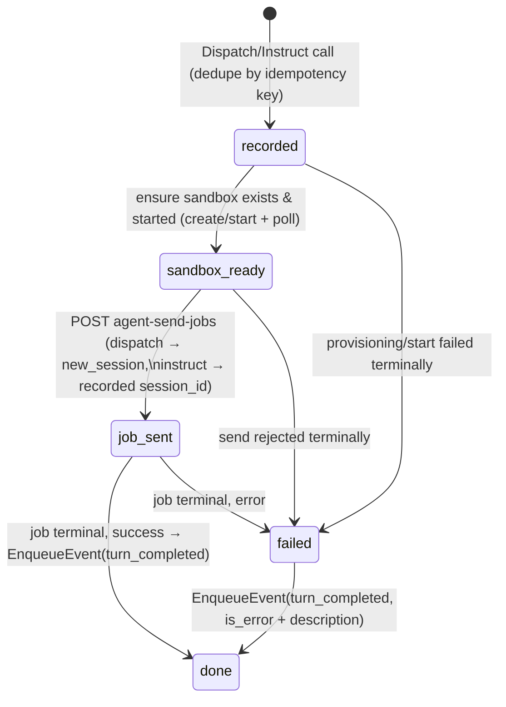

# Kiln — Amika Integration (v1)

**Date:** 2026-07-03
**Status:** Proposed
**Scope:** v1, single project, single user
**Relationship to `01`–`04`:** `02` §8 held Amika as an interface until its real docs landed.
They have: this document is designed against **Amika API v0beta1**
(`https://app.amika.dev/api/v0beta1/llms.txt`) and resolves every `02` §8 open decision. It
amends `03` in two small, logged places (§11, A1–A2). The `01` §11 deferral is closed.

## 1. Purpose & scope

This document decides:

- The concrete **interface shape and auth** against Amika v0beta1 (§3, §9).
- How a **turn result arrives** and maps to a runtime event — polling, since Amika has no
  webhooks (§2, §6).
- **Sandbox lifecycle ↔ board binding**: pool + recreate on release, with adopt-first
  startup reconciliation (§4).
- **Retry and dispatch-failure surfacing** (§7), realizing `01` §8.
- What the **mock** must simulate for the e2e loop (§8).
- The concrete payloads `03`/`04` deferred here: `amika.dispatch` / `amika.instruct`
  execution and the `agent.turn_completed` event (§5–§6).

Out of scope: what the brain does with a turn result (`02` §6); the work-instruction
*content* (title/body composition is the board's — `03` §7.1; branching strategy is prompt
material, not adapter logic).

## 2. Amika v0beta1 — the facts that shape this design

From the real docs; each drives a decision below.

| Fact | Consequence |
| --- | --- |
| **No webhooks.** Async work is job-based: `POST /sandboxes/{id}/agent-send-jobs` → 202, then poll `GET …/agent-send-jobs/{job_id}` until terminal. | Kiln owns a **poller** that turns terminal jobs into `agent.turn_completed` events (§6). The `02` §8 webhook-vs-poll question is answered by the platform. |
| **Sandbox provisioning is async**: `POST /sandboxes` → 202, then poll `GET /sandboxes/{id}` for `state`; sandboxes can be started/stopped/deleted, with `auto_stop_interval` / `auto_delete_interval`. | Provisioning cannot live inside a single outbox-handler call; the module runs its own reconciler (§4–§5). |
| **No idempotency keys.** No request dedupe is guaranteed anywhere. | The dedupe `04` §3 requires lives in **our adapter**: a small module-owned table keyed by outbox id (§7). |
| **Sessions** carry a conversation: `agent-send-jobs` takes `new_session` or `session_id`; sessions have `status` active/completed/failed and a `metadata` field. | Dispatch = new session; instruct = continuation of the recorded session (§5). |
| `GET /sandboxes/{id}` accepts **id or name**; creation takes `name`, `repo_url`, `branch`/`new_branch_name`, `agent` ("claude"/"codex"), env/secrets, scripts. | Deterministic **naming convention** makes startup adoption possible without local state (§4). |
| Errors are a uniform envelope (`error_code`, `message`, `trace_id`) over 400/401/403/404/409/502; auth is a Bearer API key. | One error-mapping layer; 404-on-delete and 409-on-conflict are treated as benign where noted (§5, §7). |

## 3. Interface — the ports

The module implements the runtime's executor ports and consumes one ingestion port. All
shapes below are the concrete contracts `03` §7.1 and `04` §6 deferred here.

**Implements (called by the outbox worker — `04` §2):**

```
Dispatch(ctx, idempotencyKey, payload)   -- amika.dispatch: start a ticket's first turn
Instruct(ctx, idempotencyKey, payload)   -- amika.instruct: resume / new turn, same session
Release(ctx, idempotencyKey, payload)    -- amika.release: recycle a slot's sandbox (§4; A1)
```

Each call **records intent and returns fast** (§5) — it never blocks on provisioning or an
agent turn. "Success" means durably recorded and the first Amika request accepted; the
reconciler and poller carry it from there.

**Consumes (the runtime's ingestion port — `04` §6):**

```
EnqueueEvent(agent.turn_completed, payload)
```

**The `agent.turn_completed` payload** (the brain's main input — `02` §6):

```json
{
  "ticket_id":        "…",
  "slot_id":          "…",      // board sandbox row (03 §2.3)
  "amika_sandbox_id": "…",
  "session_id":       "…",
  "is_error":         false,
  "result_text":      "…",      // the agent's turn output, or the failure description
  "cost_usd":         0.42
}
```

One inbound seam, deliberately: **every terminal outcome of a turn — agent finished, agent
errored, provisioning died, job failed — arrives as this event**, with `is_error` and a
description when mechanical (§7). The brain decides what failure means for the ticket
(usually `MarkBlocked`); the adapter never touches the board (§10, D3).

## 4. Sandbox lifecycle — pool + recreate on release

**The mapping.** Each of the N board slots (`03` §2.3) has one long-lived Amika sandbox,
named deterministically: **`kiln-slot-<board-sandbox-uuid>`**. The name is the join key
between board state and Amika state — no third registry.

**Startup reconciliation — adopt first, create only what's missing.** On boot (and
periodically, every 60 s, as self-healing):

1. `GET /sandboxes`, filter to the `kiln-slot-*` names matching current board slots.
2. **Adopt** every match — a previous deploy's sandboxes are ours; do **not** create
   duplicates.
3. For slots with no live sandbox, `POST /sandboxes` (repo `KILN_REPO_URL`, agent
   `KILN_AGENT`, name per convention) and poll to ready.
4. Stopped-but-present sandboxes are left stopped; dispatch starts them on demand (§5).

Creation happens **only** when a slot genuinely has no sandbox — never unconditionally.

**Recycle on release (A1).** `AcceptToDone` emits an `amika.release` entry — a new outbox
topic added to `03` §7.1, payload `{slot_id}`. The executor deletes the slot's sandbox
(404 → already gone, fine) and recreates a fresh one, so the next ticket gets a clean
workspace without paying provisioning latency at dispatch. If recreation fails past the
outbox retries (`04` §3), the entry goes dead and the **reconciler heals the slot** on its
next sweep — the failure costs latency on that slot's next dispatch, never a stuck ticket.

**The pull never waits on Amika.** A board slot is free the moment its ticket leaves
active state (`03` I2) — recycling runs behind it. If a ticket is pulled onto a slot whose
sandbox is still provisioning or stopped, dispatch simply proceeds when ready (§5); the
ticket is validly in Working while its agent spins up.

**Cost control.** Sandboxes are created with `auto_stop_interval` (config, default 30 min
idle) so warm-but-idle slots stop; `auto_delete_interval` is **not** set — deletion is
exclusively ours (release/reconciler), so a sandbox never vanishes under a Blocked ticket
that is waiting on the user overnight (`01` §5: Blocked keeps its binding).

## 5. Dispatch & instruct — the turn state machine

The module owns one small state machine per in-flight turn, persisted in its own table
(§7) and advanced by the reconciler/poller loop — never inside the port call:



- **Dispatch** sends the ticket's title + body (the `03` §7.1 payload) as the first message
  of a **new session**; the returned `session_id` is recorded on the slot for the ticket's
  lifetime.
- **Instruct** sends the instruction into the **recorded session** — the agent keeps its
  context across Blocked→Working and Working→Working (`01` §5). If Amika reports the
  session failed/gone, fall back to `new_session` with the instruction (logged; the agent
  loses conversational context but the workspace persists — the honest best effort).
- Transient Amika errors (5xx, timeouts) retry inside the machine with the same backoff
  policy as the runtime's (`04` §3, 8 attempts); terminal exhaustion → `failed` → the
  error-turn event. The outbox entry itself was already `done` after recording — the
  machine owns its own retries (§10, D2).

## 6. Inbound — the poller

One goroutine polls every active turn's job (`GET …/agent-send-jobs/{job_id}`) every
**2 s** — trivial load at N ≤ a handful of slots. Terminal job → build the §3 payload from
the job's `result_text` / `is_error` / `cost_usd` → `EnqueueEvent` → mark the turn `done`
locally. Enqueue and local mark are one transaction in the module's table — the crash
window between them re-polls a terminal job and re-enqueues; the brain's event handling
absorbs the duplicate (`04` §3; the event payload is identical, and Board API strict
preconditions stop double-application — `03` D8).

Session bookkeeping: on turn completion the session stays `active` (Amika-side) and is
reused by the next instruct; it ends naturally when the slot is recycled (§4).

## 7. Idempotency & recovery — the module's table

One module-owned Postgres table (its only state), `amika_turns`:

| Column | Purpose |
| --- | --- |
| `idempotency_key` (PK) | The outbox id (`04` §3). A repeated `Dispatch`/`Instruct`/`Release` with a seen key returns success without side effects — this is the dedupe Amika doesn't provide. |
| `kind`, `ticket_id`, `slot_id` | What this turn is. |
| `phase` | The §5 machine state (`recorded` / `sandbox_ready` / `job_sent` / `done` / `failed`). Release turns use only `recorded → done/failed` — delete, then recreate-to-ready, no job. |
| `amika_sandbox_id`, `session_id`, `job_id` | Amika-side handles as they become known. |
| `attempts`, `last_error`, timestamps | The machine's own retry bookkeeping. |

Recovery is the `04` §5 story again: the reconciler/poller loop reads this table on start
and simply continues every non-terminal turn — re-poll the job, re-check the sandbox,
re-send if never sent (the recorded phase tells it which). No recovery-specific code path.

This table is **adapter state, not board state**: which agent conversation serves a ticket
is Amika bookkeeping, invisible to board invariants. `03` §2.3's `amika_ref` column is
therefore unused and dropped (A2) — the naming convention (§4) plus this table replace it.

## 8. The mock

`AMIKA_MODE=mock` (default in dev and e2e until real credentials are configured) swaps the
adapter for an in-memory implementation of the same ports plus the same `EnqueueEvent`
inbound behavior. It must simulate, faithfully enough for `02` §14's full loop:

- **Instant lifecycle**: create/adopt/start/delete succeed immediately; the naming
  convention and adoption path are exercised for real.
- **Scripted turns**: a test-configurable script maps (ticket title / instruction) →
  (result_text, is_error, delay), defaulting to a canned success after 100 ms. Turn results
  arrive through `EnqueueEvent` exactly like production.
- **Idempotency honored**: repeated keys are no-ops — so the runtime's at-least-once
  delivery is genuinely tested against the dedupe contract.
- **Failure injection**: per-call failure modes (dispatch fails N times then succeeds;
  job returns is_error; provisioning fails terminally) to drive the `01` §8 paths in tests.

The mock keeps its state in memory — restarting the process resets it, which is fine
everywhere the mock is legal (dev, unit, integration, e2e-with-mock).

## 9. Module topology, auth & config

Per `02` §2's layering, all in `/backend/internal/amika`:

- **Turn service** — the §5 state machine, §4 reconciler, §6 poller; depends on ports only.
- **Amika client port + HTTP adapter** — thin typed client over v0beta1 (sandboxes,
  agent-send-jobs, sessions), Bearer auth, uniform error-envelope mapping.
- **Store port + Postgres adapter** — the `amika_turns` table (§7) and its migration.
- **Mock adapter** (§8) — selected at the composition root by `AMIKA_MODE`.

Config (composition root, `04` §8): `AMIKA_BASE_URL` (default
`https://app.amika.dev/api/v0beta1`), `AMIKA_API_KEY` (secret), `AMIKA_MODE` (`real`/`mock`),
`KILN_REPO_URL`, `KILN_AGENT` (default `claude`), `KILN_SANDBOX_AUTO_STOP` (default 30 min).
The API key never leaves `/backend` (`02` §2 trust boundary).

## 10. Testing

- **Unit:** the §5 state machine against a fake Amika client and fake clock — every edge
  including session-gone fallback, terminal failure → error-turn event, idempotent replay
  of every port call, reconciler adopt-vs-create decisions (N present / some present /
  none / extras).
- **Integration:** the HTTP adapter against recorded v0beta1 fixtures (error envelope
  mapping, 202-then-poll shapes); the `amika_turns` store against real Postgres, including
  the §6 enqueue+mark transaction.
- **E2E:** the `02` §14 full loop runs against the **mock** (create → dispatch → turn ends
  → decide → block → resume → done); a manual smoke checklist against real Amika gates the
  first real-credentials run.

## 11. Decision log

**Amendments to 03** (flagged per its own supersede pattern, `03` D5):

| # | Amendment | Why |
| - | --------- | --- |
| A1 | New outbox topic **`amika.release`**, emitted by `AcceptToDone`, payload `{slot_id}`. Touches `03` §7.1's topic table, the board scaffold's `Topic` list, and the outbox migration CHECK. | "Pool + recreate on release" needs a durable release trigger; the outbox is exactly the crash-safe mechanism for it, and `AcceptToDone` is the only edge that frees a slot. |
| A2 | `sandboxes.amika_ref` (`03` §2.3) is **dropped** — the naming convention (§4) plus the module's `amika_turns` table (§7) replace it. | Keeping the ref in board tables would force Amika bookkeeping writes through the Board API (`03` I8) for zero invariant value; adapter state belongs to the adapter. |

**Decisions:**

| # | Decision | Alternatives considered | Rationale |
| - | -------- | ----------------------- | --------- |
| D1 | Pool + recreate on release, adopt-first startup reconciliation. | Per-ticket create (clean but pays provisioning at every dispatch); long-lived reuse with scripted reset (fast but trusts a cleanup script not to leak state between tickets). | User decision. Fresh workspace per ticket **and** warm dispatch; adoption means a deploy never duplicates or orphans sandboxes — creation only when a slot truly lacks one. |
| D2 | Port calls record-and-return; the module's own machine owns provisioning/turn progression and its retries. | Block inside the outbox handler until the job is sent. | Provisioning can take minutes; blocking would fight the runtime's 8-attempt/~2-min budget (`04` D8) and hold the outbox lane. Recording fast keeps outbox semantics uniform; the machine's table makes the long tail crash-safe. |
| D3 | Every terminal turn outcome — including mechanical failures after dispatch was accepted — arrives as `agent.turn_completed` with `is_error`. | Adapter calls `MarkBlocked` directly on async failures. | One inbound seam; the brain owns "what does this failure mean for the ticket" (`01` §6). The runtime's direct-`MarkBlocked` path (`03` §7.3) still covers the narrower case where the *outbox delivery itself* dead-letters. |
| D4 | Turn results by polling jobs at 2 s; async `agent-send-jobs`, never sync `agent-send`. | Sync send (blocks an HTTP call for a whole coding turn); workflow-events sink. | No webhooks exist; jobs are the documented async pattern. 2 s × ≤N jobs is negligible and keeps blocker latency imperceptible. The events sink is workflow-scoped and capped — wrong tool for turn results. |
| D5 | Deterministic sandbox names (`kiln-slot-<uuid>`) as the board↔Amika join key. | Storing Amika ids in board state (`03`'s original `amika_ref`); a separate mapping registry. | Names survive crashes with no local state, make adoption a pure list-and-match, and `GET /sandboxes/{name}` is first-class in v0beta1. |
| D6 | `auto_stop_interval` on, `auto_delete_interval` off. | Amika-side auto-delete as GC. | Stop saves cost safely (start-on-demand at dispatch). Delete must stay exclusively ours: a Blocked ticket can hold its sandbox overnight (`01` §5) and auto-delete would yank it. |

**Open questions (owned elsewhere or later):** sandbox `state` values are not enumerated
in v0beta1 — the client treats readiness as "reachable and not provisioning/errored" and
must be hardened against the real value set during implementation; `preset`/`size`/
`env_vars`/`secret_env_vars`/`integration_ids` for the project sandbox are deployment
configuration (`02` §15), not contract; per-agent `agent_credentials` handling follows
`02` §12 (secrets).
